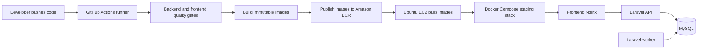
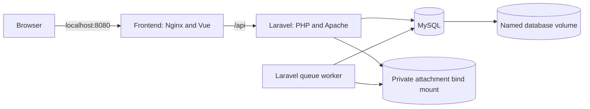

# CampusDesk CI/CD Learning Track

This file is the entry point for the CampusDesk CI/CD work. Detailed implementation records live under `Docs/`.

## Current status

- [x] Repair and verify existing backend and frontend quality gates.
- [x] Dockerize the Laravel backend.
- [x] Dockerize the Vue frontend with an Nginx runtime.
- [x] Run MySQL, Laravel, the queue worker, and the frontend with Docker Compose.
- [x] Verify health checks, queue execution, private attachment persistence, database persistence, and same-origin API proxying.
- [ ] Learn the GitHub Actions execution model.
- [ ] Add continuous integration for backend and frontend checks.
- [ ] Build immutable images in CI.
- [ ] Publish images to Amazon ECR.
- [ ] Deploy the staging stack to an Ubuntu EC2 instance.

## Completed Session 1

Read [CI/CD Session 1: Local Docker Foundation](Docs/CI_CD_SESSION_1_DOCKER.md) for:

- the final local architecture;
- every file added and why it exists;
- environment and secret handling;
- networking and storage behavior;
- queue worker lifecycle and shutdown handling;
- upload limits;
- operating commands;
- verification evidence and troubleshooting history;
- known limitations before AWS staging.

## End-to-end direction

## Local architecture now available

## Next learning checkpoint

Before creating `.github/workflows/ci.yml`, explain and verify the distinction between:

- a workflow and a job;
- a runner and a deployed server;
- a step and an action;
- CI test dependencies and production image dependencies;
- repository variables, GitHub secrets, and values compiled into the frontend.

The first CI implementation will run existing checks. It will not publish or deploy images.
