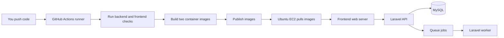
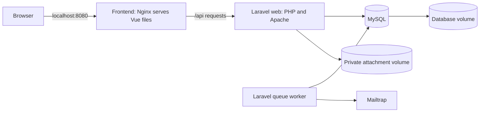

```mermaid
flowchart LR
    A[You push code] --> B[GitHub Actions runner]
    B --> C[Run backend and frontend checks]
    C --> D[Build two container images]
    D --> E[Publish images]
    E --> F[Ubuntu EC2 pulls images]
    F --> G[Frontend web server]
    G --> H[Laravel API]
    H --> I[(MySQL)]
    H --> J[Queue jobs]
    J --> K[Laravel worker]
```

```mermaid
flowchart LR
    Browser -->|localhost:8080| Web[Frontend: Nginx serves Vue files]
    Web -->|/api requests| API[Laravel web: PHP and Apache]
    API --> DB[(MySQL)]
    Worker[Laravel queue worker] --> DB
    Worker --> Mailtrap
    API --> Uploads[(Private attachment volume)]
    DB --> Data[(Database volume)]
```