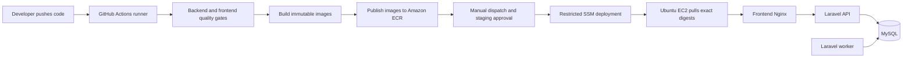
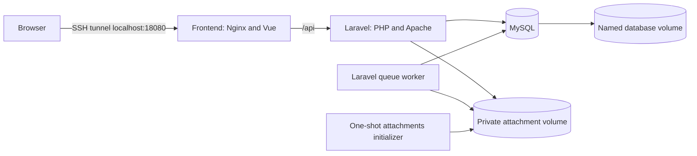

# CampusDesk CI/CD Learning Track

**Last reviewed:** 2 October 2026

This file is the entry point for the CampusDesk CI/CD work. Detailed implementation records live under `Docs/`.

## Current status

- [x] Repair and verify existing backend and frontend quality gates.
- [x] Dockerize the Laravel backend.
- [x] Dockerize the Vue frontend with an Nginx runtime.
- [x] Run MySQL, Laravel, the queue worker, and the frontend with Docker Compose.
- [x] Verify health checks, queue execution, private attachment persistence, database persistence, and same-origin API proxying.
- [x] Learn the GitHub Actions execution model.
- [x] Add continuous integration for backend and frontend checks.
- [x] Build images in CI after the quality gates pass.
- [x] Publish commit-SHA-tagged images to immutable Amazon ECR repositories through GitHub OIDC.
- [x] Deploy digest-pinned images to an Ubuntu 24.04 AMD64 EC2 instance.
- [x] Run migrations and the full demonstration seed explicitly.
- [x] Create and verify student and Super Admin access.
- [x] Restrict the staging frontend to EC2 loopback and access it through an SSH tunnel.
- [x] Add a protected, manually approved deployment workflow using GitHub OIDC and a restricted SSM document.
- [x] Verify deployment locking, exact digest resolution, migration execution, health checks, and the idempotent no-op path.
- [x] Initialize the private attachment volume before application startup and reject failed storage writes without persisting corrupt records.
- [x] Functionally verify the full request lifecycle and authenticated attachment upload/download in staging.
- [ ] Automate backup and restore verification.
- [ ] Add DNS and HTTPS before controlled public staging access.

## Comprehensive implementation and operations guide

Read the consolidated [CI/CD Comprehensive Implementation and Operations Guide](Docs/CI_CD_SESSION_2_HANDOFF.md) for:

- the verified local Docker architecture, files, service boundaries, and operating commands;
- local environment, networking, persistence, queue, upload-limit, health-check, and shutdown behavior;
- local and staging verification evidence and troubleshooting history;
- the current GitHub Actions workflow and event behavior;
- GitHub OIDC, least-privilege IAM, and ECR configuration;
- the EC2 architecture and security boundary;
- digest-pinned Compose deployment and operating commands;
- the protected GitHub `staging` environment, dedicated deployment role, restricted SSM document, and fixed host script;
- migrations, one-time seeding, and manual Super Admin creation;
- attachment-volume initialization, storage failure handling, authorization hardening, and staging verification;
- every significant deployment failure and its resolution; and
- current limitations and prioritized continuation work.

## End-to-end direction

```mermaid
flowchart LR
    A[Developer pushes code] --> B[GitHub Actions runner]
    B --> C[Backend and frontend quality gates]
    C --> D[Build immutable images]
    D --> E[Publish images to Amazon ECR]
    E --> F[Manual dispatch and staging approval]
    F --> S[Restricted SSM deployment]
    S --> G[Ubuntu EC2 pulls exact digests]
    G --> H[Frontend Nginx]
    H --> I[Laravel API]
    I --> J[(MySQL)]
    K[Laravel worker] --> J
```

## Current staging architecture

```mermaid
flowchart LR
    Browser -->|SSH tunnel localhost:18080| Web[Frontend: Nginx and Vue]
    Web -->|/api| API[Laravel: PHP and Apache]
    API --> DB[(MySQL)]
    Worker[Laravel queue worker] --> DB
    API --> Uploads[(Private attachment volume)]
    Worker --> Uploads
    Init[One-shot attachments initializer] --> Uploads
    DB --> Data[(Named database volume)]
```

## Next learning checkpoint

The controlled deployment workflow is implemented and verified. The next milestone is recoverability and security hardening before public access:

1. establish and restore-test database and attachment backups;
2. remove or rotate the known shared passwords in the demonstration seed;
3. record deployed image digests in a secure operational location;
4. evaluate Systems Manager Session Manager so interactive SSH can eventually be removed; and
5. add DNS and HTTPS only after the private staging security baseline is complete.

Pushes to `development` publish immutable images automatically. EC2 deployment remains deliberately manual-triggered and approval-gated, and the application remains private behind an SSH tunnel. Repository changes to `compose.staging.yaml` or the fixed host deployment script require a separate reviewed host update.
