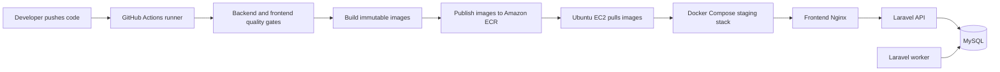
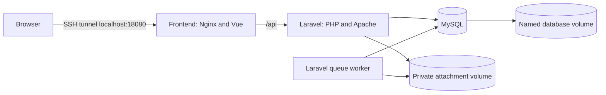

# CampusDesk CI/CD Learning Track

This file is the entry point for the CampusDesk CI/CD work. Detailed implementation records live under `Docs/`.

## Current status

- [x] Repair and verify existing backend and frontend quality gates.
- [x] Dockerize the Laravel backend.
- [x] Dockerize the Vue frontend with an Nginx runtime.
- [x] Run MySQL, Laravel, the queue worker, and the frontend with Docker Compose.
- [x] Verify health checks, queue execution, private attachment persistence, database persistence, and same-origin API proxying.
- [x] Learn the GitHub Actions execution model.
- [x] Add continuous integration for backend and frontend checks.
- [x] Build images in CI after the quality gates pass.
- [x] Publish commit-SHA-tagged images to immutable Amazon ECR repositories through GitHub OIDC.
- [x] Deploy digest-pinned images to an Ubuntu 24.04 AMD64 EC2 instance.
- [x] Run migrations and the full demonstration seed explicitly.
- [x] Create and verify student and Super Admin access.
- [x] Restrict the staging frontend to EC2 loopback and access it through an SSH tunnel.
- [ ] Automate backup and restore verification.
- [ ] Add a protected, manually approved EC2 deployment workflow.
- [ ] Add DNS and HTTPS before controlled public staging access.

## Completed Session 1

Read [CI/CD Session 1: Local Docker Foundation](Docs/CI_CD_SESSION_1_DOCKER.md) for:

- the final local architecture;
- every file added and why it exists;
- environment and secret handling;
- networking and storage behavior;
- queue worker lifecycle and shutdown handling;
- upload limits;
- operating commands;
- verification evidence and troubleshooting history;
- known limitations before AWS staging.

## Completed Session 2

Read [CI/CD and AWS Staging Handoff](Docs/CI_CD_SESSION_2_HANDOFF.md) for:

- the current GitHub Actions workflow and event behavior;
- GitHub OIDC, least-privilege IAM, and ECR configuration;
- the EC2 architecture and security boundary;
- digest-pinned Compose deployment and operating commands;
- migrations, one-time seeding, and manual Super Admin creation;
- every significant deployment failure and its resolution; and
- current limitations and prioritized continuation work.

## End-to-end direction

```mermaid
flowchart LR
    A[Developer pushes code] --> B[GitHub Actions runner]
    B --> C[Backend and frontend quality gates]
    C --> D[Build immutable images]
    D --> E[Publish images to Amazon ECR]
    E --> F[Ubuntu EC2 pulls images]
    F --> G[Docker Compose staging stack]
    G --> H[Frontend Nginx]
    H --> I[Laravel API]
    I --> J[(MySQL)]
    K[Laravel worker] --> J
```

## Current staging architecture

```mermaid
flowchart LR
    Browser -->|SSH tunnel localhost:18080| Web[Frontend: Nginx and Vue]
    Web -->|/api| API[Laravel: PHP and Apache]
    API --> DB[(MySQL)]
    Worker[Laravel queue worker] --> DB
    API --> Uploads[(Private attachment volume)]
    Worker --> Uploads
    DB --> Data[(Named database volume)]
```

## Next learning checkpoint

The next milestone is a controlled deployment workflow rather than more image-publication work. Before implementing it:

1. establish and restore-test database and attachment backups;
2. remove or rotate the known shared passwords in the demonstration seed;
3. evaluate AWS Systems Manager as the deployment transport instead of placing an SSH key in GitHub;
4. define deployment locking, migration failure behavior, health checks, and rollback boundaries; and
5. require manual approval through a protected staging environment.

The current workflow publishes images only. EC2 deployment remains manual and the application remains private behind an SSH tunnel.
