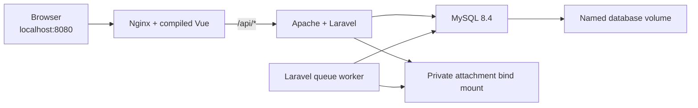
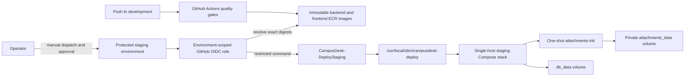

# CampusDesk — System Architecture

**Last reviewed:** 7 October 2026

## Overall Architecture

CampusDesk is a **decoupled SPA + REST API** architecture:

```
┌─────────────────────────┐         ┌─────────────────────────────┐
│   Vue 3 SPA             │  HTTP   │   Laravel 12 API            │
│   Frontend/src/         │ ──────► │   campusdesk/               │
│   localhost:5173        │  JSON   │   127.0.0.1:8000            │
│                         │◄─────── │                             │
│   Axios + Bearer token  │         │   Sanctum token auth        │
└─────────────────────────┘         └──────────────┬──────────────┘
                                                   │
                                    ┌──────────────┼──────────────┐
                                    │              │              │
                               ┌────▼────┐   ┌────▼────┐   ┌────▼────┐
                               │  MySQL  │   │ Storage │   │ Queue   │
                               │  DB     │   │ (files) │   │ (jobs)  │
                               └─────────┘   └─────────┘   └─────────┘
                                                                │
                                                          ┌─────▼─────┐
                                                          │ Mailtrap  │
                                                          │ (dev mail)│
                                                          └───────────┘
```

### Verified local container topology

The bare development ports above remain available. The reproducible Docker Compose topology uses one public entry point instead:



Only Nginx publishes a host port. Compose DNS provides the internal `backend` and `db` hostnames. The backend and worker share one image but run different main processes. See the consolidated [CI/CD implementation and operations guide](CI_CD_SESSION_2_HANDOFF.md) for the complete runtime design and verification record.

### Verified AWS staging delivery topology



The deployment is automated after a manual workflow dispatch and protected-environment approval. It validates the full release SHA, resolves exact ECR digests, serializes deployments, verifies images before downtime, runs migrations once, recreates application services, and performs health/API smoke tests. Re-dispatching the active release follows a verified no-op path. The workflow does not copy `compose.staging.yaml` or replace the root-owned host script; those host changes require a separate reviewed rollout. See [CI_CD_SESSION_2_HANDOFF.md](CI_CD_SESSION_2_HANDOFF.md).

## Frontend Architecture

The Issue #7 presentation refactor adds the shared `components/ui` layer, `components/layout/AuthLayout.vue`, domain components, and guarded nested pages for each role. The role views are layout hosts containing `RouterView`; page-scoped composables load only the data needed by the selected URL. Existing service modules and singleton `useAuth` remain in place; no new store or backend API was introduced. See [UI_UX.md](UI_UX.md) and the [verification record](FRONTEND_REDESIGN.md).

- **Framework:** Vue 3 with Composition API and `<script setup>`
- **Language:** TypeScript (strict mode)
- **Build tool:** Vite 6
- **Styling:** Tailwind CSS 3.x + DaisyUI 5.x
- **Routing:** Vue Router 4 (HTML5 history mode)
- **HTTP client:** Axios 1.x with request/response interceptors
- **State management:** No Pinia/Vuex — singleton composable pattern (`useAuth`)
- **Auth token storage:** `localStorage` (token + user object)
- **Test runner:** Vitest 2.x with `@vue/test-utils`

### Frontend Directory Structure
```
Frontend/
├── src/                           ← THE REAL VUE SPA (all development happens here)
│   ├── main.ts                    ← app bootstrap
│   ├── App.vue                    ← root component, logout handler, notification bell
│   ├── style.css                  ← global styles
│   ├── types/
│   │   └── index.ts               ← ALL TypeScript interfaces (single source of truth)
│   ├── composables/
│   │   ├── useAuth.ts             ← token + user state management
│   │   ├── useStudentRequests.ts  ← student list/detail state
│   │   └── admin/                 ← page-scoped admin state
│   ├── services/
│   │   ├── api.ts                 ← Axios instance + interceptors
│   │   ├── auth.ts                ← login/register/logout API calls
│   │   ├── requests.ts            ← student request API calls
│   │   ├── stages.ts              ← staff stage API calls
│   │   ├── notifications.ts       ← in-app notification API calls
│   │   ├── deptAdmin.ts           ← department oversight/reassignment
│   │   ├── admin.ts               ← Super Admin APIs
│   │   └── reference.ts           ← dropdown data (faculties, depts, etc.)
│   ├── router/
│   │   └── index.ts               ← routes + role-based guards
│   ├── views/
│   │   ├── LoginView.vue          ← login page
│   │   ├── RegisterView.vue       ← student registration page
│   │   ├── StudentView.vue        ← student layout + nested RouterView
│   │   ├── StaffView.vue          ← staff layout + nested RouterView
│   │   ├── DeptAdminView.vue      ← department-admin layout + RouterView
│   │   ├── SuperAdminView.vue     ← Super Admin layout + RouterView
│   │   ├── student/               ← overview, list, create, detail pages
│   │   ├── staff/                 ← overview, queue, active-case pages
│   │   ├── dept-admin/            ← overview and department-work pages
│   │   └── admin/                 ← overview, requests, users, references, history
│   └── components/
│       ├── student/               ← request form and request card
│       ├── staff/                 ← case card and resolution workspace
│       ├── admin/                 ← shared admin fields, pagination, audit, delete dialog
│       ├── ui/                    ← modal, icons, headers, skeletons, empty states
│       ├── DocumentViewer.vue     ← blob URL file viewer (WIRED)
│       ├── RequestTimeline.vue    ← stage progression display
│       ├── NotificationBell.vue   ← notification bell (wired to notification API)
│       ├── StatusBadge.vue        ← coloured status pill
│       └── LevelBadge.vue         ← student level display
├── package.json                   ← Vue/Vite project (correct — use this)
├── vite.config.js                 ← Vite config with @ alias → src/
└── tailwind.config.ts             ← Tailwind config
```

All frontend application code is contained in `Frontend/src/`; the project is a Vue/Vite SPA.

## Backend Architecture

- **Framework:** Laravel 12
- **Language:** PHP `^8.2`; verified container runtime PHP 8.3
- **Auth:** Laravel Sanctum 4.x (Bearer token mode)
- **Queue:** Database driver (`jobs` table)
- **Mail:** SMTP via Mailtrap (development)
- **File storage:** Laravel Storage facade (explicit local disk, `storage/app/private/attachments/`)
- **ORM:** Eloquent with relationships, observers, and model events

### Backend Structure
```
campusdesk/
├── app/
│   ├── Http/
│   │   ├── Controllers/
│   │   │   ├── Auth/
│   │   │   │   ├── AuthenticatedSessionController.php  ← login (token response)
│   │   │   │   │                                         logout revokes current Sanctum token
│   │   │   │   └── RegisteredUserController.php        ← registration + student profile
│   │   │   ├── RequestController.php                   ← student request CRUD
│   │   │   │                                              (uses StageGenerationService)
│   │   │   ├── RequestStageController.php              ← staff queue + claim + resolve
│   │   │   ├── NotificationController.php               ← list + mark-read notifications
│   │   │   ├── AttachmentController.php                ← protected file serving
│   │   │   ├── ReferenceDataController.php             ← public dropdown data
│   │   │   ├── DeptAdminController.php                 ← primary-department oversight/reassignment
│   │   │   ├── AdminReferenceController.php            ← protected reference CRUD
│   │   │   ├── AdminUserController.php                 ← protected user/admin-level CRUD
│   │   │   └── AdminOverviewController.php             ← stats, requests, status history
│   │   ├── Middleware/
│   │   │   ├── EnsureIsStudent.php      ← checks is_student gate
│   │   │   ├── EnsureIsStaff.php        ← checks is_staff gate
│   │   │   ├── EnsureIsDeptAdmin.php    ← checks is-dept-admin gate
│   │   │   │                               matches is-dept-admin gate
│   │   │   └── EnsureIsSuperAdmin.php   ← checks is-super-admin gate
│   │   └── Requests/
│   │       ├── StoreRequestRequest.php      ← student request validation
│   │       └── UpdateStageStatusRequest.php ← stage resolve validation
│   ├── Models/
│   │   ├── User.php
│   │   ├── Faculty.php              ← includes matricule_prefix field
│   │   ├── Department.php           ← includes type field (academic|records|admin)
│   │   ├── Programme.php            ← includes department_id field; auto-syncs faculty_id
│   │   ├── StudentProfile.php
│   │   ├── StaffProfile.php
│   │   ├── DepartmentStaff.php      ← pivot model
│   │   ├── RequestType.php
│   │   ├── Request.php              ← aliased as DocumentRequest/UserRequest
│   │   ├── RequestStage.php
│   │   ├── StatusHistory.php
│   │   ├── Attachment.php
│   │   └── Notification.php
│   ├── Observers/
│   │   └── RequestStageObserver.php ← auto stage status history
│   ├── Jobs/
│   │   └── SendRequestStatusNotification.php
│   ├── Mail/
│   │   └── RequestStatusUpdated.php
│   ├── Services/
│   │   ├── StageGenerationService.php  ← resolves symbolic department tokens
│   │   ├── RequestCreationService.php  ← creates request/stage/history graph atomically
│   │   ├── SeedRequestProgressionService.php ← advances deterministic seed fixtures
│   │   └── RequestStatusNotificationService.php ← queues email + creates in-app lifecycle notifications
│   ├── Http/Resources/
│   │   ├── RequestResource.php
│   │   ├── RequestStageResource.php
│   │   └── UserResource.php
│   └── Providers/
│       └── AppServiceProvider.php     ← Gates + Observer registration
│                                         department-admin gate name is aligned
├── database/
│   ├── migrations/                  ← 28 migration files total
│   ├── factories/
│   │   ├── UserFactory.php          ← creates staff + student users with auto profiles
│   │   └── DepartmentFactory.php
│   └── seeders/
│       ├── DatabaseSeeder.php       ← orchestrates all seeders in dependency order
│       ├── FacultySeeder.php        ← reads from university_programs_structure.md
│       ├── DepartmentSeeder.php     ← reads parsed faculties; seeds academic + records depts
│       ├── ProgrammeSeeder.php      ← seeds programmes per department
│       ├── StaffSeeder.php          ← seeds 80 staff users via UserFactory
│       ├── StudentSeeder.php        ← seeds 10 students per academic department
│       ├── DepartmentStaffSeeder.php← assigns staff to depts; primary→dept_admin
│       ├── RequestTypeSeeder.php    ← seeds 4 request types with symbolic sequences
│       └── Support/
│           ├── FacultyMarkdownParser.php    ← parses university structure markdown
│           ├── FacultyMatriculeMapper.php   ← maps faculty codes to matricule prefixes
│           ├── DepartmentTypeMapper.php     ← maps dept codes to type enum values
│           ├── StudentDistributionHelper.php← distributes students across levels
│           └── university_programs_structure.md ← UB faculty/dept/programme data
├── routes/
│   ├── api.php                      ← all API routes
│   └── auth.php                     ← Breeze auth routes
├── config/
│   ├── cors.php                     ← CORS (allows localhost:5173)
│   └── sanctum.php                  ← stateful domains
├── bootstrap/
│   └── app.php                      ← HandleCors + middleware aliases
├── tests/
│   ├── Feature/                     ← auth, routing, lifecycle, admin, seeder, attachment tests
│   └── Unit/                        ← default scaffold example only
└── resources/views/
    └── emails/
        └── request-status-update.blade.php ← notification email template
```

## Authentication Architecture

CampusDesk uses **Sanctum Bearer token authentication** (not cookie/SPA mode).

```
POST /api/login
  ↓
AuthenticatedSessionController::store()
  ↓
$user->createToken('auth_token')->plainTextToken
  ↓
Response: { token: "...", user: { id, name, email, role, student_profile, staff_profile } }
  ↓
Frontend stores token in localStorage
  ↓
Axios request interceptor reads token → adds "Authorization: Bearer {token}" to every request
  ↓
auth:sanctum middleware validates token on every protected request
```

**Important:** `EnsureFrontendRequestsAreStateful` was intentionally REMOVED from `bootstrap/app.php`. It caused redirects that broke token-based auth. Only `HandleCors` is prepended to the middleware stack.

`AuthenticatedSessionController::destroy()` revokes the current Sanctum token. The historical session-method issue is resolved.

## Authorization Architecture

Three-layer authorization:

1. **Route middleware** — broad role gates (`student`, `staff`, `dept_admin`, `super_admin`)
2. **Form Request `authorize()`** — per-request role checks
3. **Controller-level checks** — fine-grained ownership and business rule enforcement

Gates defined in `AppServiceProvider::boot()`:
```php
Gate::define('is_student', fn(User $user) => $user->role === 'student');
Gate::define('is_staff',   fn(User $user) => $user->role === 'staff');
Gate::define('is-dept-admin', fn(User $user) =>
    $user->role === 'staff' && $user->staffProfile?->admin_level === 'dept_admin');
Gate::define('is-super-admin', fn(User $user) =>
    $user->role === 'staff' && $user->staffProfile?->admin_level === 'super_admin');
```

`is_student` and `is_staff` use underscores; the two admin gates use hyphens. Each middleware checks the gate name actually defined in `AppServiceProvider`.

Middleware aliases in `bootstrap/app.php`:
- `student` → `EnsureIsStudent`
- `staff` → `EnsureIsStaff`
- `dept_admin` → `EnsureIsDeptAdmin`
- `super_admin` → `EnsureIsSuperAdmin`

## File Storage Architecture

Uploaded attachments are stored through Laravel's explicit `local` disk in `storage/app/private/attachments/` (private, not under `public/`). In staging, backend and worker mount the shared `attachments_data` volume at that path.

Files are served through `AttachmentController::show()` which:
1. Validates that the authenticated user is the request owner, a Super Admin, an assigned handler, or staff in a department on the request route
2. Returns 404 if the physical local-disk object is missing
3. Streams the file using `Storage::disk('local')->response()` with its original filename and MIME type

`RequestController::store()` treats a false or empty storage result as an error, rolls back the request metadata, and removes files written earlier in a failed multi-file transaction. In staging, the network-isolated one-shot `attachments-init` service creates the mounted directory as `www-data:www-data` mode `0750` and must succeed before backend or worker startup.

Frontend receives a file ID, fetches it via Axios with `responseType: 'blob'`, creates a `URL.createObjectURL(blob)` for display in `` and `<iframe>` tags. This sidesteps the Bearer token limitation on HTML src attributes.

## Queue / Async Architecture

Lifecycle notifications are created and email notifications are dispatched as queued jobs:

```
Request status transition
  ↓
RequestStatusNotificationService::notifyStudent()
  ↓
INSERT notifications row + SendRequestStatusNotification::dispatch(...)->afterCommit()
  ↓
Job pushed to `jobs` table (database queue driver)
  ↓
php artisan queue:work (or the `composer run dev-mail` script) picks up job
  ↓
Mail::to($student)->send(new RequestStatusUpdated(...))
  ↓
Mailtrap (dev) receives email
```

Queue must be running for notification emails to send. Use `composer run dev-mail` to start Laravel, the queue worker, and Vite together, or run `php artisan queue:work` in a separate terminal. `composer run dev` intentionally starts only Laravel and Vite.

## Deferred Integration Architecture

Three future integration initiatives have been scoped but are not implemented. The design-system overhaul formerly listed here shipped in Issue #7; its remaining work is browser acceptance and optional E2E automation, not a new frontend architecture.

- **Real-time delivery:** `RequestStatusNotificationService` is the current lifecycle notification seam. Future first-party real-time UI updates should publish domain events from that seam and use WebSockets or SSE; signed webhooks are reserved for third-party consumers. Delivery must be queued, idempotent, retryable, and auditable.
- **AI support:** An AI gateway must be isolated from request mutation paths. It may receive curated support knowledge and redacted, read-only context only. Escalation requires persisted support conversations/messages and a human handoff ticket associated with a department or super administrator.
- **Payments:** Mobile Money support must sit behind a provider interface. A `payments` aggregate and verified provider webhook will control an `awaiting_payment` request state; successful-payment handling must lock the payment and request records before releasing the request into the existing stage queue.

## Stage Sequence Resolution Architecture

Request types store a `default_department_sequence` JSON array that can contain either literal department IDs or symbolic tokens. When a student submits a request, the sequence is resolved to concrete department IDs:

- `"STUDENT_DEPARTMENT"` → resolves to the student's own `department_id`
- `"FACULTY_RECORDS"` → resolves to the `records`-type department in the student's faculty
- Integer → used as-is

**Current implementation:** `StageGenerationService::resolveSequence()` maps the complete template through `resolveDepartmentId()`. `RequestCreationService` injects and uses the stage service to create the request, stages, and initial history atomically; `RequestController::store()` uses the creation service before adding attachments in its outer transaction. Reopening does not regenerate stages.

## Seeder Architecture

The seeder suite parses a real University of Buea faculty/department/programme structure from a markdown file (`database/seeders/Support/university_programs_structure.md`) and seeds a complete, realistic dataset:

1. `FacultySeeder` — all UB faculties with matricule prefixes
2. `DepartmentSeeder` — all departments with type classification (`academic`/`records`/`admin`); also creates one `records` department per faculty
3. `ProgrammeSeeder` — all programmes linked to departments
4. `StaffSeeder(80)` — 80 staff users with auto-generated profiles
5. `StudentSeeder(10/dept)` — 10 students per academic department
6. `DepartmentStaffSeeder` — assigns all staff to departments; primary staff automatically elevated to `dept_admin`
7. `RequestTypeSeeder` — 4 request types (Transcript, Enrollment Attestation, Completion Attestation, Correction of Transcript)
8. `RequestSeeder(24)` — deterministic requests distributed across pending, in-review, forwarded, ready, rejected, and collected states
9. `AttachmentSeeder` — private-storage attachment fixtures
10. `NotificationSeeder` — in-app demonstration notifications
