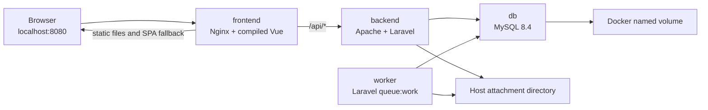

# CI/CD Session 1: Local Docker Foundation

**Completed:** 25 September 2026

**Status:** Complete and verified

**Next stage:** Continuous integration with GitHub Actions

## Purpose

This session established a reproducible, production-style local container environment for CampusDesk before introducing CI or deployment automation. The work was performed incrementally so that each Docker concept and service boundary could be verified independently.

No GitHub Actions workflow, image registry, or AWS deployment was added during this session.

## Verified starting point

The repository was inspected and the existing application checks were repaired before containerization.

- Backend: Laravel 12.56.0, PHP 8.3 target, Composer, Sanctum Bearer tokens, Eloquent, database queues, private local storage, and queued mail notifications.
- Frontend: Vue 3, TypeScript, Axios, Vite 6.4.2, Vitest, and ESLint.
- Database: MySQL.
- Development host: Windows with Docker Desktop running Linux containers.
- Package manager selected for the frontend: npm with `package-lock.json`.
- Generated `Frontend/dist/` output is ignored and rebuilt from source.
- `Frontend/pnpm-lock.yaml` was removed to avoid competing lock files.

The last pre-Docker verification during this session was:

- Backend: 54 PHPUnit tests passed with 354 assertions.
- Frontend: 37 Vitest tests passed.
- `npx vue-tsc --noEmit`: passed.
- `npm run lint`: passed after establishing the ESLint flat configuration and fixing application errors.
- `npm run build`: passed.

See [TESTING.md](TESTING.md) for the current test inventory.

## Resulting architecture



Only the frontend publishes a host port. The backend, worker, and database are reachable only through the Compose network.

## Service responsibilities

### `frontend`

- Built from `Frontend/Dockerfile`.
- Uses Node 22 Alpine only during the build stage.
- Runs `npm ci` and `npm run build`.
- Copies the resulting `dist/` directory into a small Nginx runtime image.
- Publishes `localhost:8080` to container port 80.
- Serves Vue routes with an `index.html` fallback.
- Proxies `/api/*` to the Compose hostname `backend`.
- Builds with `VITE_API_URL=/api` so browser requests remain same-origin.

### `backend`

- Built from `campusdesk/Dockerfile` using `php:8.3-apache`.
- Installs `pdo_mysql`, PCNTL, and `unzip`.
- Copies Composer from the official Composer image.
- Installs production PHP dependencies with `--no-dev`.
- Uses Apache with `/var/www/html/public` as its document root.
- Loads the application configuration from container environment variables.
- Exposes no host port.
- Has an HTTP health check against `http://127.0.0.1/up`.
- Mounts private attachments from the host.

### `worker`

- Uses the same `campusdesk-backend:local` image as the backend.
- Overrides the image's Apache command with:

```text
php artisan queue:work --sleep=3 --tries=3 --backoff=5 --timeout=60 -v
```

- Uses the same application, database, mail, and storage environment as the backend.
- Publishes no port.
- Waits for MySQL to become healthy.
- Restarts unless it was explicitly stopped.
- Uses `SIGTERM` instead of the Apache image's inherited `SIGWINCH` stop signal.
- Has a 70 second grace period, which is longer than the 60 second job timeout.

### `db`

- Uses the official `mysql:8.4` image.
- Was verified at MySQL 8.4.11 during this session.
- Initializes the application database and non-root application user from runtime variables.
- Stores `/var/lib/mysql` in the `campusdesk_db_data` named volume.
- Publishes no host port.
- Uses `mysqladmin ping` for its health check.

## Files added

- [`compose.yaml`](../compose.yaml): defines the four services, health checks, environment, storage, and dependencies.
- [`.env.docker.example`](../.env.docker.example): documents required local secret values without containing real credentials.
- [`campusdesk/Dockerfile`](../campusdesk/Dockerfile): backend and worker image definition.
- [`campusdesk/.dockerignore`](../campusdesk/.dockerignore): excludes secrets, dependencies, Git data, logs, caches, and the local SQLite file from the backend build context.
- [`campusdesk/docker/apache-vhost.conf`](../campusdesk/docker/apache-vhost.conf): points Apache to Laravel's `public/` directory and enables `.htaccess` rewrites.
- [`campusdesk/docker/php-uploads.ini`](../campusdesk/docker/php-uploads.ini): aligns PHP upload limits with Nginx and Laravel.
- [`Frontend/Dockerfile`](../Frontend/Dockerfile): multi-stage frontend build and Nginx runtime.
- [`Frontend/.dockerignore`](../Frontend/.dockerignore): excludes dependencies, generated output, Git data, and environment files.
- [`Frontend/docker/nginx.conf`](../Frontend/docker/nginx.conf): static serving, SPA fallback, API proxy, forwarded headers, and request-size limit.

The root [`.gitignore`](../.gitignore) now excludes `.env.docker` and `docker-data/`.

## Image and container model

The backend image contains the application source, PHP extensions, Composer dependencies, Apache configuration, and PHP configuration. It does not contain `.env`.

The backend and worker are separate containers created from the same image. Their main commands give them different roles:

```text
backend container -> Apache foreground process
worker container  -> Laravel queue worker
```

Rebuilding an image tag does not mutate an existing container. A running worker remains pinned to the image ID from which it was created. After rebuilding the backend image, both backend and worker must be recreated.

Use this command after a backend image change:

```cmd
docker compose --env-file .env.docker up -d --force-recreate backend worker frontend
```

The frontend is included because Nginx resolves the backend service when it starts. Recreating it ensures that it resolves the replacement backend container.

## Runtime environment and secrets

The real `.env.docker` file is ignored by Git. It currently supplies:

```dotenv
DB_DATABASE=campusdesk
DB_USERNAME=campusdesk
DB_PASSWORD=<local-secret>
DB_ROOT_PASSWORD=<different-local-secret>
APP_KEY=base64:<generated-key>
```

Compose substitutes these values and supplies them to the running containers. Laravel reads the container environment; the values are not copied into image layers.

Generate an application key with:

```cmd
docker run --rm campusdesk-backend:local php artisan key:generate --show
```

Runtime environment variables are still visible to users with Docker administrator access. This is acceptable for the learning environment. AWS will require a deliberate secret-management approach later.

`VITE_*` variables are different: Vite embeds them in browser JavaScript during `npm run build`. They are public configuration and must never contain secrets.

## Networking and request routing

Compose creates the `campusdesk_default` network automatically. Containers discover one another through Docker DNS using service names.

- Laravel connects to `DB_HOST=db`, not `127.0.0.1`.
- Nginx proxies to `http://backend`.
- The browser calls `/api` through `http://localhost:8080` because the browser cannot resolve Docker service names.
- `127.0.0.1` inside a container refers to that same container.

Nginx forwards `$http_host` so Laravel sees the public host and port, including `localhost:8080`.

The expected paths are:

```text
GET /          -> Nginx serves the compiled Vue entry point
GET /admin     -> Nginx falls back to index.html for Vue Router
GET /api/user  -> Nginx proxies to Laravel
```

An unauthenticated API request with `Accept: application/json` correctly returns JSON `401 Unauthorized`. Without that header, Laravel may treat the request as a browser navigation and return a login redirect.

## Persistent data

### MySQL

The `db_data` named volume is mounted at `/var/lib/mysql`. It survives container deletion and `docker compose down`.

The verified volume name is:

```text
campusdesk_db_data
```

Never use the following command unless the database is intentionally being reset:

```cmd
docker compose --env-file .env.docker down -v
```

The `-v` option deletes the named database volume.

### Attachments

Laravel's `local` filesystem root is `storage/app/private`. The application stores request files under `attachments`, giving this container path:

```text
/var/www/html/storage/app/private/attachments
```

It is bind-mounted to:

```text
docker-data/attachments
```

The backend and worker see the same directory. A file written as the Apache user was verified on Windows, from the worker, and again after all application containers were replaced.

This protects attachments from container replacement. It does not protect them from host disk loss or EC2 instance replacement. Staging will need a backup plan, an attached EBS volume, or later migration to S3.

## Queue behavior

CampusDesk uses `QUEUE_CONNECTION=database`. Status updates dispatch `SendRequestStatusNotification` with `afterCommit()`, so a job is queued only after the database transaction commits.

The verified lifecycle is:

```text
Laravel inserts job into jobs table
worker reserves job
worker renders and sends through configured mail driver
worker deletes successful job
failed job is retained in failed_jobs after attempts are exhausted
```

The local Compose environment uses `MAIL_MAILER=log`. Queue execution is real, but messages are written to worker logs rather than delivered externally.

A controlled smoke test verified that:

- the stopped worker left one row in `jobs`;
- starting the worker processed `Illuminate\Mail\Mailable`;
- the message appeared in `docker compose logs worker`;
- `jobs` returned to zero;
- `failed_jobs` remained zero.

PCNTL was added because Laravel requires it to enforce `--timeout`. The 60 second worker timeout is shorter than the database queue's 90 second `retry_after`, reducing duplicate-processing risk.

The Apache base image declares `STOPSIGNAL SIGWINCH`. That caused the queue worker to ignore Docker's stop request and wait the entire 70 second grace period before being killed. The worker service now overrides it with `stop_signal: SIGTERM`. Verified worker shutdown time dropped from approximately 70 seconds to 0.2 seconds while idle.

## Upload-size boundaries

Uploads pass through three independent layers:

```text
Nginx -> PHP -> Laravel validation
```

The final limits are:

- Nginx: 30 MB total HTTP request via `client_max_body_size 30m`.
- PHP: 6 MB per file via `upload_max_filesize`.
- PHP: 32 MB total POST body via `post_max_size`.
- PHP: up to 20 uploaded files via `max_file_uploads`.
- Laravel: 5 MB per attachment via `max:5120`.
- Laravel: PDF, DOCX, JPG, and PNG MIME types.

The PHP per-file value is slightly above the Laravel rule so Laravel can return its intended validation response for files around the application limit. The repository currently has no explicit Laravel maximum for the number of attachments; that remains a product validation decision.

## Health checks and startup ordering

The MySQL health check prevents Laravel and the worker from starting merely because the MySQL process exists. It waits until MySQL accepts connections.

The backend health check prevents the frontend from starting before Apache and Laravel answer HTTP requests.

Current dependency order:

```text
db healthy -> backend starts -> backend healthy -> frontend starts
db healthy -> worker starts
```

The Laravel `/up` endpoint proves that Apache, PHP, and Laravel can answer HTTP. It does not execute a database query. Migration and queue tests provided the separate database integration evidence.

On a brand-new empty database, run migrations before starting the worker to avoid polling a missing `jobs` table.

## First-time local startup

From the repository root in Command Prompt:

```cmd
copy .env.docker.example .env.docker
docker compose --env-file .env.docker build backend frontend
docker run --rm campusdesk-backend:local php artisan key:generate --show
```

Edit `.env.docker`, replace both password placeholders, and add the generated key. Then start the database and backend first:

```cmd
docker compose --env-file .env.docker up -d db backend
docker compose --env-file .env.docker exec backend php artisan migrate
docker compose --env-file .env.docker up -d worker frontend
```

Open:

```text
http://localhost:8080
```

## Daily operating commands

Start the stack:

```cmd
docker compose --env-file .env.docker up -d
```

Inspect state and logs:

```cmd
docker compose --env-file .env.docker ps
docker compose --env-file .env.docker logs -f
docker compose --env-file .env.docker logs -f worker
```

Run migrations:

```cmd
docker compose --env-file .env.docker exec backend php artisan migrate
docker compose --env-file .env.docker exec backend php artisan migrate:status
```

Rebuild after Dockerfile, dependency, or source changes:

```cmd
docker compose --env-file .env.docker up -d --build --force-recreate backend worker frontend
```

Stop and remove replaceable resources while retaining data:

```cmd
docker compose --env-file .env.docker down
```

Validate the Compose file without printing resolved secret values:

```cmd
docker compose --env-file .env.docker config --quiet
```

## Verification completed

The following evidence was collected successfully:

- Docker Desktop ran Linux containers and the `hello-world` smoke test.
- Backend image built with PHP 8.3.33, `pdo_mysql`, PCNTL, Artisan, and Composer vendor files.
- `.env` was absent from the backend image.
- Apache served Laravel from `public/` and `/up` returned HTTP 200.
- Frontend image built successfully and served Vue through Nginx.
- `/admin` returned the SPA entry point on direct refresh.
- Nginx proxied `/api/user` to Laravel and returned JSON 401 for a guest.
- MySQL 8.4 became healthy and accepted the non-root application credentials.
- All 28 migrations ran and remained present after `docker compose down` and reconstruction.
- The database named volume survived removal of the database container and Compose network.
- The queue worker processed a controlled mail job with no failed job.
- A private attachment survived replacement of backend, worker, and frontend containers.
- Backend and worker were confirmed on the same image ID after recreation.
- Only the frontend exposed a host port.
- PHP loaded the custom upload configuration.
- The worker stopped gracefully with `SIGTERM`.

Final durability test result:

```text
docker compose down                 -> all containers/network removed
campusdesk_db_data                  -> remained present
docker compose up -d                -> full stack reconstructed
php artisan migrate:status          -> all migrations still Ran
GET localhost:8080/api/user         -> JSON 401 Unauthorized
```

## Problems encountered and lessons

### Composer could not download packages

The initial backend build failed because neither PHP Zip nor `unzip` was available. Installing `unzip` in the image allowed Composer's distribution archives to be extracted.

### Windows shell continuation differed

The backtick is a PowerShell continuation character. The commands were being run in Command Prompt, where continuation uses `^`. One-line commands avoid this distinction.

### `localhost` did not reach sibling containers

Each container has its own network namespace. Laravel must use `db`, and Nginx must use `backend`, to reach sibling services.

### A guest API request returned 302 instead of 401

Plain curl did not advertise JSON. Supplying `Accept: application/json` produced the expected API response. CampusDesk's Axios instance already sends this header.

### A rebuilt tag left the old worker running

The backend tag moved to a new image, while the existing worker remained pinned to the previous image ID. Force recreation is required for long-lived workers after a build or pull.

### Queue worker recreation took 70 seconds

The shared Apache image's `SIGWINCH` stop signal was unsuitable for `queue:work`. The worker now overrides it with `SIGTERM`.

### PHP silently imposed a smaller upload limit

The base image allowed only 2 MB per file and 8 MB per POST, while Laravel allowed 5 MB per file. The custom INI file aligned the layers.

### Apache emits a global `ServerName` warning

Apache logs a harmless warning before starting because the global server name is unset. The virtual host has `ServerName localhost`, and HTTP behavior is correct. A global Apache configuration can remove the warning later.

## Current limitations before staging

- Local passwords are stored in an ignored file rather than a managed secret service.
- `APP_DEBUG=true` is appropriate only for local development.
- Mail uses the log driver; Mailtrap SMTP is not configured in Compose yet.
- There is no TLS termination.
- The MySQL named volume has no automated backup.
- The attachment bind mount depends on the host disk.
- The backend health endpoint does not include database readiness.
- Migrations are an explicit operation and are not yet orchestrated by deployment automation.
- Backend and frontend images use local tags and are not published to a registry.
- Base image tags are not yet pinned to immutable digests.
- Image size has not been optimized. The observed local sizes were approximately 821 MB for the backend, 94 MB for the frontend, and 1.11 GB for MySQL as reported by Compose.
- The environment represents one machine and does not provide high availability.

These are acceptable for the local learning stage. They must be revisited deliberately before an AWS staging deployment.

## Boundary for Session 2

Session 2 begins with the GitHub Actions mental model and CI only. Before writing a workflow, cover:

1. Events and triggers such as `push` and `pull_request`.
2. GitHub-hosted runners and their disposable filesystem.
3. Workflows, jobs, steps, actions, and shell commands.
4. Dependency installation from lock files.
5. Service containers for backend MySQL tests versus the current default SQLite test configuration.
6. Independent backend and frontend jobs.
7. Caching versus correctness.
8. Required checks and failure behavior.

The first workflow should run existing quality gates only:

```text
Backend: Composer install -> PHPUnit
Frontend: npm ci -> lint -> vue-tsc -> Vitest -> production build
```

Image publishing, ECR, EC2, and continuous deployment remain later stages.
