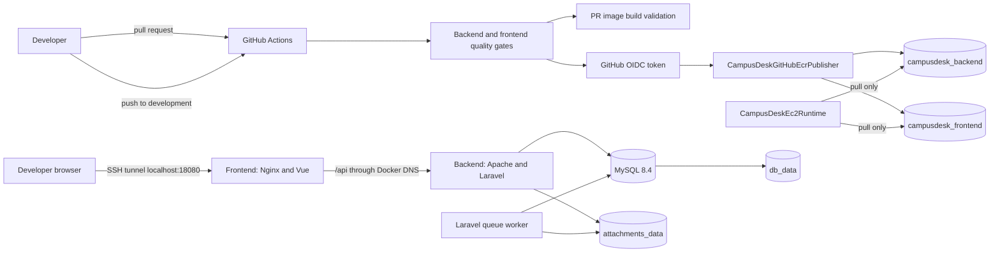

# CampusDesk CI/CD and AWS Staging Handoff

**Prepared:** 30 September 2026

**Repository branch:** `development`

**Verified repository commit:** `166e96c Configure Nginx Docker DNS resolver`

**Current phase:** CI, ECR publication, and the first EC2 staging deployment are complete

**Runtime status:** all four staging services are running; the SPA is reachable through an SSH tunnel at `http://localhost:18080`; seeded student and manually created Super Admin accounts can authenticate

## Purpose

This is the authoritative continuation record for the CampusDesk CI/CD work completed after the local Docker foundation documented in [CI_CD_SESSION_1_DOCKER.md](CI_CD_SESSION_1_DOCKER.md).

It records:

- what is implemented in the repository;
- which AWS resources were created and why;
- which operational steps were completed manually on EC2;
- failures encountered and their fixes;
- the current security and availability boundaries;
- repeatable operating commands; and
- the next recommended work in priority order.

This file intentionally excludes AWS account IDs, public IP addresses, DNS names, ECR digests, passwords, application keys, private keys, and user credentials.

## Current checkpoint

The following state has been confirmed by repository inspection and operator evidence:

- GitHub Actions runs backend and frontend quality gates independently.
- Pull requests validate both Docker image builds.
- Pushes to `development` build and publish backend and frontend images to Amazon ECR.
- GitHub authenticates to AWS through OpenID Connect (OIDC); no long-lived AWS access key is stored in GitHub.
- Both ECR repositories use immutable tags.
- Published images are tagged with the full Git commit SHA.
- EC2 pulls images with its instance role and deploys exact ECR digest references.
- The EC2 role can pull from only the two CampusDesk repositories and cannot push.
- The staging stack consists of MySQL, Laravel/Apache, a Laravel queue worker, and Vue/Nginx.
- Only Nginx is bound on the host, and it is bound to `127.0.0.1:8080` rather than a public interface.
- Access currently uses SSH local forwarding to `localhost:18080` on the developer machine.
- All migrations have run successfully.
- The full demonstration dataset has been seeded successfully as an explicit one-time operation.
- A Super Admin user and profile were created separately and successfully.
- The frontend Nginx configuration dynamically re-resolves the backend service through Docker DNS.

The current delivery boundary is important: **CI and image publication are automated; deployment from ECR to EC2 remains a controlled manual operation.**

## Architecture now implemented



## Repository milestone history

The relevant commits on `development` are:

| Commit | Outcome |
| --- | --- |
| `484076d` | Added backend and frontend CI quality gates. |
| `8533641` | Merged the initial GitHub Actions CI pull request. |
| `cea2b51` | Added Docker image build validation. |
| `6274306` | Pinned GitHub-hosted jobs to Ubuntu 24.04. |
| `99e8bce` | Merged container build validation. |
| `bd1aea4` | Verified GitHub-to-AWS OIDC role assumption. |
| `90d5ae6` | Merged OIDC authentication work. |
| `0af1c09` | Added immutable backend and frontend ECR publication. |
| `16d9e5b` | Merged ECR publishing. |
| `7d6ca98` | Added the staging PEM filename to `.gitignore`. |
| `046203f` | Recorded SSH-security work. |
| `0fd3153` | Added digest-pinned staging Compose configuration. |
| `a6639dd` | Merged the EC2 staging configuration. |
| `ec2a2d1` | Made Faker available in the production-style backend image for explicit staging seeding. |
| `166e96c` | Added dynamic Docker DNS resolution to frontend Nginx. |

## Continuous integration

The workflow is [.github/workflows/ci.yml](../.github/workflows/ci.yml).

### Triggers and permissions

The workflow runs for:

- pull requests targeting `development`;
- pushes to `development`; and
- manual `workflow_dispatch` runs.

The workflow-level permission is `contents: read`. Only the two ECR publishing jobs elevate their job-specific permissions with `id-token: write`, which is required for OIDC role assumption.

### Quality gates

The backend and frontend jobs run independently and therefore execute in parallel.

Backend job:

1. checks out the repository;
2. configures PHP 8.3 and Composer 2;
3. verifies PHP, Composer, and `pdo_sqlite`;
4. installs the locked dependencies, including development packages; and
5. runs `composer test`.

The backend test environment uses SQLite in memory, array mail, a synchronous queue, and array-backed cache/session stores from `campusdesk/phpunit.xml`. A MySQL service is therefore not required for the current unit and feature suite.

Frontend job:

1. checks out the repository;
2. configures Node 22;
3. runs `npm ci` from the lock file;
4. runs ESLint;
5. runs `vue-tsc --noEmit` through `npm run typecheck`;
6. runs Vitest; and
7. produces the Vite build with `VITE_API_URL=/api`.

### Staging configuration gate

The `staging-config` job runs:

```bash
docker compose \
  --env-file .env.staging.example \
  --file compose.staging.yaml \
  config --quiet
```

All build and publication jobs depend on this check, so invalid staging configuration blocks both PR validation and ECR publication.

### PR image builds versus push publication

For pull requests and manual non-push runs:

- `backend-image` builds `campusdesk-backend:ci`;
- `frontend-image` builds `campusdesk-frontend:ci`; and
- neither image is pushed.

For a push to `development`:

- the standalone validation image jobs are skipped;
- `backend-publish` builds and pushes the backend image; and
- `frontend-publish` builds and pushes the frontend image.

This avoids building an image and then rebuilding the same commit again merely for publication within one push workflow. A pull request build and its later merge-commit build are intentionally different because they represent different Git commits.

### Immutable-tag reruns

ECR tag immutability means a rerun cannot overwrite an existing commit-SHA tag. Each publish job therefore calls `aws ecr describe-images` first:

- if the SHA tag exists, publication is skipped successfully;
- if ECR returns `ImageNotFoundException`, the image is built and pushed; and
- any other AWS error fails the job.

This made workflow reruns safe after the first successful publication.

## AWS registry and identity design

### Region and ECR repositories

All current AWS resources are in `eu-north-1`.

The private repositories are:

- `campusdesk_backend`
- `campusdesk_frontend`

Both repositories were created with immutable tags and AES-256 server-side encryption.

Git commit SHAs provide traceability from an image tag back to source. Deployment uses the image digest because a digest cryptographically identifies the image contents, whereas a tag remains a registry pointer even when operational controls make it immutable.

### GitHub OIDC publishing role

GitHub Actions assumes `CampusDeskGitHubEcrPublisher` with `sts:AssumeRoleWithWebIdentity`.

The trust policy is restricted to:

- the AWS OIDC provider for `token.actions.githubusercontent.com`;
- audience `sts.amazonaws.com`; and
- the exact repository and `development` branch subject.

The final subject form is equivalent to:

```text
repo:Sama-Mokom/CampusDesk:ref:refs/heads/development
```

It must not contain a full `https://github.com/...` URL. That malformed subject was encountered during setup and corrected before OIDC verification succeeded.

The workflow uses repository variables:

- `AWS_ROLE_ARN`
- `AWS_REGION`
- `AWS_ACCOUNT_ID`
- `ECR_BACKEND_REPOSITORY`
- `ECR_FRONTEND_REPOSITORY`

No permanent AWS access-key pair is required by the workflow.

### Publishing permissions

`CampusDeskEcrPushPolicy` grants:

- `ecr:GetAuthorizationToken` on `*`, because this authentication operation is account/registry scoped; and
- layer and image publication operations on only the two CampusDesk repository ARNs.

The repository-scoped actions are:

- `ecr:BatchCheckLayerAvailability`
- `ecr:BatchGetImage`
- `ecr:CompleteLayerUpload`
- `ecr:DescribeImages`
- `ecr:InitiateLayerUpload`
- `ecr:PutImage`
- `ecr:UploadLayerPart`

This is not broad ECR administrator access.

### EC2 runtime role

The EC2 instance profile role is `CampusDeskEc2Runtime`. Its trust relationship permits EC2 (`ec2.amazonaws.com`) to assume it.

`CampusDeskEcrPullPolicy` grants:

- `ecr:GetAuthorizationToken` on `*`; and
- `ecr:BatchCheckLayerAvailability`, `ecr:BatchGetImage`, and `ecr:GetDownloadUrlForLayer` on only the exact backend and frontend repository ARNs.

The runtime role cannot upload layers, call `PutImage`, or alter registry content. This separation limits what a compromised application host could do to other consumers of the registry.

AWS CLI obtains temporary credentials from the EC2 Instance Metadata Service. Docker still requires `docker login` because the AWS CLI and Docker use separate credential formats and stores. `aws ecr get-login-password` exchanges the role credentials for a short-lived Docker-compatible registry token.

## Cost controls and infrastructure choice

An AWS monthly cost budget was configured for USD 20 with notifications at:

- 50% of actual spend;
- 80% of actual spend; and
- 100% of forecast spend.

A budget is an alerting control, not a hard spending limit.

The final instance is a `t3.small` rather than:

- `t3.micro`, whose 1 GiB RAM was considered insufficient for MySQL, Laravel, the queue worker, Nginx, Docker, and the operating system; or
- `t4g.small`, whose ARM64 architecture would differ from the AMD64 GitHub runners and published images.

The final host characteristics verified during setup were:

- Ubuntu 24.04 LTS;
- AMD64/x86-64 architecture;
- 2 vCPUs;
- approximately 1.863 GiB usable memory;
- a 30 GiB encrypted gp3 root volume;
- IMDSv2 required;
- termination protection enabled;
- no Auto Scaling Group; and
- no Elastic IP.

The absence of an Elastic IP means the public address can change after a stop/start cycle. No stable public DNS deployment should depend on the current address.

The security group currently permits SSH on port 22 only from the operator's current `/32` public address. The application is not directly published through the security group.

## EC2 host preparation

### SSH access

Initial SSH attempts timed out because the network path to port 22 was not yet valid for the operator's current source address. The security-group source was corrected to the current public `/32`, after which SSH succeeded.

The PEM file was added to `.gitignore` and moved outside the repository workspace. It must never be committed, copied into an image, or placed on the EC2 instance.

### Docker installation

The first Docker installation attempt failed with:

```text
Malformed entry 1 in list file /etc/apt/sources.list.d/docker.list (Component)
```

The Docker APT source entry was repaired and Docker Engine was installed successfully. Verification showed:

- Docker Engine 29.8.1;
- Docker Compose v5.5.1;
- overlayfs/containerd storage;
- cgroup v2; and
- x86-64 architecture.

### AWS CLI and instance-role verification

The AWS CLI was installed and `aws configure list` showed credentials from `iam-role`, not a local profile. `aws sts get-caller-identity` confirmed an assumed session for `CampusDeskEc2Runtime`.

### Image pulling

The host authenticated to ECR with its instance role, pulled backend and frontend images, and verified both as `linux/amd64`. Docker was then logged out of ECR.

Images are deployed by digest. The mutable Git SHA tag is used to locate the published image, and the resolved `RepoDigest` is placed in `.env.staging`.

The MySQL 8.4 image is also pinned by digest.

## Staging Compose implementation

The tracked files are:

- [compose.staging.yaml](../compose.staging.yaml)
- [.env.staging.example](../.env.staging.example)

The real `/opt/campusdesk/.env.staging` exists only on EC2, is ignored by Git, and was set to mode `600`.

### Image policy

All three image references must use digests. Every service uses `pull_policy: never`.

This policy means deployment fails immediately if the selected digest has not already been pulled onto the host. It does not itself provide cryptographic identity or zero downtime:

- the digest provides exact content identity;
- `pull_policy: never` enforces local-only use of the selected artifact; and
- the current single-host Compose deployment is not zero-downtime.

### Service behavior

`db`:

- runs MySQL 8.4;
- uses the non-root application database user;
- stores data in `db_data`;
- exposes no host port; and
- reports readiness through `mysqladmin ping`.

`backend`:

- runs the published PHP 8.3/Apache image;
- receives all configuration at runtime;
- stores private attachments in `attachments_data`;
- exposes no host port; and
- checks Laravel's `/up` endpoint.

`worker`:

- uses exactly the same backend digest;
- runs `php artisan queue:work` rather than Apache;
- shares configuration and attachments with the backend;
- uses `SIGTERM`; and
- has a 70-second grace period for jobs with a 60-second timeout.

`frontend`:

- serves the built Vue SPA through Nginx;
- proxies `/api/` to the Compose service name `backend`;
- binds host port 8080 only on `127.0.0.1`; and
- waits for the backend health check on initial startup.

All services use Docker's `local` logging driver with a 10 MiB maximum file size and three retained files.

## Current access path

The frontend is deliberately not public. The operator connects with local port forwarding similar to:

```bash
ssh -i /path/outside/the/repository/CampusDesk-staging-key.pem \
  -L 18080:127.0.0.1:8080 \
  ubuntu@<current-ec2-public-dns>
```

The application is then opened at:

```text
http://localhost:18080
```

Local port 18080 was chosen because another local application (EDB/Postgres) was already serving on port 8080.

The direct API smoke test on EC2 returned the expected JSON `401 Unauthenticated` for `/api/user` when sent with `Accept: application/json`. Public reference endpoints returned data after seeding.

## Database initialization and accounts

### Migrations

Migrations are an explicit deployment operation:

```bash
cdc run --rm backend php artisan migrate --force
```

They are not run by container entrypoints. This prevents multiple backend or worker replicas from racing to change the schema and keeps migration failure separate from container health and restart behavior.

### Full staging seed

The full demonstration seed was run once and completed successfully. `DatabaseSeeder` currently orchestrates:

- faculty, department, and programme reference data;
- 80 staff accounts;
- 10 students for each eligible academic department;
- staff-to-department assignments;
- request types;
- 24 requests; and
- seeded attachments and notifications.

Seeding is not part of normal deployments. Several seeders create additive business data and are not globally idempotent. The top-level seed is also not wrapped in one transaction; individual seeders commit independently. If a future seed attempt fails, inspect table counts before considering a rerun.

The generated demo accounts use the known factory password `password`. **The current seeded environment must remain private until those accounts are removed, disabled, or assigned unique credentials.**

### Super Admin

The seeders intentionally do not create a Super Admin. One was created manually after the full seed by creating the `users` and `staff_profiles` rows inside one Laravel database transaction.

The resulting authorization model is:

```text
users.role = staff
staff_profiles.admin_level = super_admin
```

The password was supplied through a non-echoing shell prompt, passed to the temporary container by environment-variable name, and hashed by the `User` model's `hashed` cast. The credentials must not be recorded in this repository.

## Stable EC2 command helper

Do not use the name `dc`; Ubuntu already provides `/usr/bin/dc`, the desktop calculator. Shell functions also disappear after an SSH session ends.

Define this helper in each session:

```bash
cdc() {
  docker compose \
    --env-file /opt/campusdesk/.env.staging \
    --file /opt/campusdesk/compose.staging.yaml \
    "$@"
}
```

Useful commands:

```bash
cdc config --quiet
cdc ps
cdc logs --tail=100 backend
cdc logs --tail=100 worker
cdc logs --tail=100 frontend
cdc exec backend php artisan migrate:status
```

## Manual deployment procedure currently in use

There is no automated EC2 deployment yet. A controlled update should follow this order.

### 1. Record the currently deployed digests

```bash
grep -E '^(BACKEND_IMAGE|FRONTEND_IMAGE|MYSQL_IMAGE)=' /opt/campusdesk/.env.staging
cdc images
```

Keep the previous application digest references available for application rollback. Do not commit them if doing so would disclose the AWS account ID.

### 2. Authenticate and pull the selected artifacts

```bash
AWS_REGION=eu-north-1
AWS_ACCOUNT_ID="$(aws sts get-caller-identity --query Account --output text)"
ECR_REGISTRY="${AWS_ACCOUNT_ID}.dkr.ecr.${AWS_REGION}.amazonaws.com"

aws ecr get-login-password --region "$AWS_REGION" |
  docker login --username AWS --password-stdin "$ECR_REGISTRY"

docker pull '<backend-repository>@sha256:<selected-digest>'
docker pull '<frontend-repository>@sha256:<selected-digest>'

docker logout "$ECR_REGISTRY"
unset AWS_ACCOUNT_ID ECR_REGISTRY
```

Do not replace the placeholders in this document with real account identifiers or digests.

### 3. Update and validate `.env.staging`

Set `BACKEND_IMAGE` and/or `FRONTEND_IMAGE` to the selected digest references, then run:

```bash
chmod 600 /opt/campusdesk/.env.staging
cdc config --quiet
```

### 4. Run database changes explicitly

Stop the worker gracefully before migrations:

```bash
cdc stop --timeout 70 worker
cdc run --rm backend php artisan migrate --force
```

Migration compatibility must be considered when the old backend is still serving. This single-host process does not guarantee zero downtime.

### 5. Recreate application services

```bash
cdc up -d --force-recreate backend worker frontend
cdc ps
```

### 6. Verify

```bash
cdc exec frontend sh -c 'getent hosts backend; wget -S -O- http://backend/up'
curl -i -H 'Accept: application/json' http://127.0.0.1:8080/api/user
cdc logs --tail=100 backend
cdc logs --tail=100 worker
cdc logs --tail=100 frontend
```

Expected unauthenticated behavior for `/api/user` is HTTP 401 with JSON, not HTTP 200.

## Problems encountered and resolved

| Symptom | Cause | Resolution and lesson |
| --- | --- | --- |
| GitHub could not assume the AWS role initially. | The OIDC trust-policy subject contained an invalid full GitHub URL/repository form. | Restricted `sub` to the exact repository and `development` ref and kept `aud=sts.amazonaws.com`. Trust answers who can assume; the permission policy answers what the role can do. |
| Concern about stored AWS access keys in GitHub. | Static credentials would have been long-lived secrets. | Used GitHub OIDC and short-lived STS credentials. No AWS access-key pair is stored in GitHub. |
| ECR reruns could collide with immutable SHA tags. | ECR correctly rejects overwriting an existing immutable tag. | Publish jobs check whether the SHA already exists and skip only that known condition. |
| PR publication jobs appeared skipped. | Publishing is intentionally restricted to pushes on `development`. | PRs run tests and image builds; merged pushes publish. |
| Standalone image-build jobs appeared skipped on `development`. | Push publication jobs build the publishable artifact themselves. | This avoids a redundant second build during the same push workflow. |
| SSH timed out on port 22. | The instance security-group path did not yet allow the operator's current source address. | Restricted SSH to the correct `/32`; connectivity then succeeded. |
| Risk of committing the PEM file. | The key was temporarily located in the workspace. | Ignored the filename and moved the key outside the repository. |
| `apt` reported a malformed Docker source entry. | `/etc/apt/sources.list.d/docker.list` was malformed. | Repaired the official Docker repository entry, then installed and verified Docker Engine and Compose. |
| `docker` remained unavailable after the first installation attempt. | Package installation never completed because APT could not parse its sources. | Fixed the source first, reran installation, and verified client/server output. |
| Multiline Compose commands failed on Windows. | PowerShell backticks were pasted into Command Prompt, where they are not continuation characters. | Used a one-line command or the correct shell-specific continuation syntax. |
| Docker required ECR login despite the instance role. | Docker and AWS CLI do not share a credential store or protocol. | Used `aws ecr get-login-password` to obtain a short-lived registry token, piped it to `docker login`, then logged out. |
| `dc run --rm ...` invoked an unrelated program. | `dc` is Ubuntu's desktop calculator, and the intended shell function had disappeared after reconnecting. | Adopted the absolute-path `cdc` helper. |
| Compose searched for `/home/ubuntu/.env.staging`. | The command used a relative environment path while the shell was in `/home/ubuntu`. | The `cdc` helper now uses absolute `/opt/campusdesk` paths. The failed Super Admin attempt never reached Laravel or opened a transaction. |
| Local browser port 8080 showed an EDB/Postgres page. | Another local program already occupied port 8080. | Forwarded EC2 port 8080 to local port 18080 instead. |
| `db:seed` failed with `Call to undefined function Database\\Factories\\fake()`. | The production-style backend image uses `composer install --no-dev`, but Faker was classified as a development dependency even though runtime staging seeders require it. | Commit `ec2a2d1` moved `fakerphp/faker` into `require`, rebuilt/published the backend image, and retained `--no-dev` for all unrelated development dependencies. |
| The failed seed left reference tables populated. | `DatabaseSeeder` uses separate transactions for individual seeders rather than one transaction for the full orchestration. | Confirmed the additive user/request tiers had rolled back before retrying. Reference seeders use `updateOrCreate`; the repaired image then completed the seed. |
| The SPA loaded but `/api/faculties`, `/api/departments`, and `/api/programmes` returned Nginx 502. | Backend recreation changed its Docker IP while the unchanged Nginx process retained the previous startup resolution. | Commit `166e96c` configured Docker's `127.0.0.11` resolver and variable-based `proxy_pass`, allowing re-resolution of `backend`. |
| `curl /api/user` returned 401. | The endpoint requires authentication. | This was the expected healthy result when `Accept: application/json` was included, not a failure. |

## Security decisions already made

- No permanent AWS credentials are stored in GitHub or EC2 configuration files.
- GitHub and EC2 use separate IAM roles with separate publish and pull permissions.
- ECR access is limited to the exact CampusDesk repositories wherever AWS supports resource scoping.
- EC2 requires IMDSv2.
- The SSH private key is outside the repository.
- Real staging secrets live only in the ignored EC2 `.env.staging`, mode `600`.
- MySQL and Laravel expose no host ports.
- Nginx binds to loopback, forcing current access through SSH and preventing accidental public port-8080 exposure.
- Migrations and seeds are explicit operations rather than container startup side effects.
- Application images and MySQL are selected by digest.
- Private database and attachment state live in named volumes rather than replaceable containers.
- Container logs are rotated.

## Known limitations and risks

### Security

- Seeded users share the known factory password `password`; the stack must remain private.
- HTTP is currently unencrypted inside the SSH tunnel, and there is no public TLS endpoint.
- SSH remains an exposed administrative path, although source-restricted.
- Secrets remain in a host file rather than AWS Systems Manager Parameter Store or Secrets Manager.
- No image-signing, SBOM, or enforced vulnerability gate has been implemented.
- Third-party GitHub Actions use version tags rather than reviewed full commit SHAs.

### Availability and recovery

- One EC2 instance is a single point of failure.
- MySQL and attachments share the instance's storage lifecycle.
- No automated database or attachment backup has been documented or restore-tested.
- No Auto Scaling Group, load balancer, or rolling deployment exists.
- Deployment is not zero-downtime.
- Application rollback may be unsafe after a backward-incompatible migration.
- There is no Elastic IP, so stop/start can change the public endpoint.

### Operations

- EC2 deployment is manual; GitHub Actions stops after ECR publication.
- Detailed CloudWatch monitoring, container alerting, and centralized application logs are not configured.
- The approximately 2 GiB host has limited memory headroom. Swap creation was recommended, but its final active/persistent state has not been captured in repository evidence and should be verified.
- Mail currently uses the `log` driver rather than a real staging SMTP provider.
- The Laravel `/up` health check proves HTTP application startup but does not directly query MySQL.
- ECR lifecycle/retention policy and automatic scanning status have not been documented.

## Immediate verification for the next operator

Run locally:

```powershell
git branch --show-current
git status --short
git log -1 --oneline
Get-Content .github\workflows\ci.yml
Get-Content compose.staging.yaml
```

Expected Git state when this document was prepared:

- branch `development`;
- HEAD `166e96c`;
- this handoff file modified/untracked until deliberately committed; and
- one unrelated zero-byte untracked file whose name resembles a concatenated SSH target. Inspect it and remove it only after confirming it is accidental.

Run on EC2:

```bash
aws sts get-caller-identity
docker --version
docker compose version
swapon --show
free -h
df -h /

cdc config --quiet
cdc ps
cdc exec backend php artisan migrate:status
```

Do not paste the resulting account ID, public hostname, image digests, environment values, or credentials into issues or committed documentation.

## Recommended next steps

### Priority 1: protect and recover the existing state

1. Verify that swap is active and persists across reboot.
2. Record disk, memory, and container usage after the completed seed.
3. Create a MySQL backup procedure and perform a test restore into an isolated database/volume.
4. Back up `attachments_data` and test restoration.
5. Record the currently deployed backend, frontend, and MySQL digests in a secure operational location.
6. Decide whether the demo users should be deleted, disabled, or assigned unique passwords before any broader access.

### Priority 2: harden administrative access

1. Confirm the SSH `/32` rule still matches the intended administrator.
2. Evaluate AWS Systems Manager Session Manager so port 22 can eventually be removed.
3. Move runtime secrets to Parameter Store or Secrets Manager and define a rotation procedure.
4. Add least-privilege permissions only as each new operational capability is introduced.

### Priority 3: design controlled continuous deployment

The recommended next CI/CD milestone is a manually approved deployment workflow, not an automatic deploy on every push.

It should:

1. run only after the exact commit's images exist in ECR;
2. require approval through a protected GitHub staging environment;
3. use AWS control-plane access such as Systems Manager rather than storing an SSH private key in GitHub;
4. pass or resolve exact image digests;
5. verify the host has pulled each digest before Compose runs;
6. acquire a deployment lock;
7. stop the worker gracefully;
8. run `migrate --force` once;
9. recreate backend, worker, and frontend;
10. perform health and API smoke tests;
11. report the deployed digests; and
12. provide an explicit application rollback path, while acknowledging migration rollback constraints.

### Priority 4: prepare for controlled public staging access

Before opening the application beyond the SSH tunnel:

1. remove the shared demo password risk;
2. establish a stable address and DNS strategy;
3. add TLS termination and automatic certificate renewal;
4. expose only ports 80/443 through a reviewed security group;
5. preserve the internal loopback/backend isolation model;
6. configure the final application and frontend URLs;
7. review CORS and authentication behavior for the real origin; and
8. complete a security-focused smoke test.

### Priority 5: observability and CI hardening

- Add CPU, memory, disk, health, and billing alerts.
- Centralize or export application/container logs.
- Add a MySQL 8.4 migration compatibility job alongside the fast SQLite suite.
- Add workflow concurrency to cancel superseded PR runs where appropriate.
- Evaluate dependency caching without weakening lock-file reproducibility.
- Pin third-party actions to reviewed commit SHAs.
- Add ECR lifecycle rules and vulnerability scanning policy.
- Generate SBOMs and evaluate image signing/provenance.

## Do not assume these are complete

The next developer or agent must not claim that any of the following already exists:

- automatic deployment from GitHub to EC2;
- public HTTPS access;
- zero-downtime deployment;
- database or attachment backup automation;
- centralized monitoring or alerting;
- secret-manager integration;
- ECR lifecycle cleanup;
- image signing; or
- high availability.

## Continuation rule

Preserve the established learning and implementation approach:

1. explain the operational or security problem first;
2. compare meaningful alternatives and tradeoffs;
3. implement one bounded change;
4. validate it from repository state and runtime evidence;
5. do not commit, push, expose services publicly, or mutate AWS resources without explicit authorization; and
6. update this document whenever the deployment contract changes.
