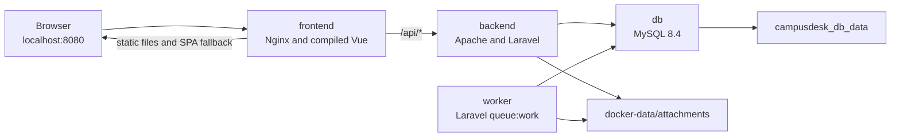
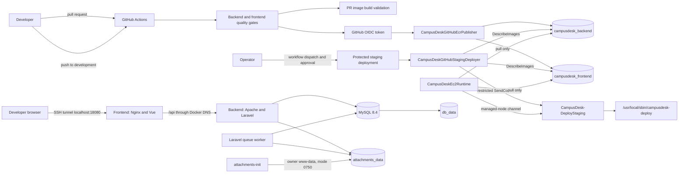

# CampusDesk CI/CD Comprehensive Implementation and Operations Guide

**Coverage:** Local Docker foundation completed 25 September 2026 through account-security and credential-remediation implementation verified 9 October 2026

**Last reviewed and updated:** 9 October 2026

**Repository branches:** `development` remains the deployment integration target; the account-security change sequence was prepared on `valib`. Recovery automation and its validation record were merged by PR #20 at merge commit `989ca54`.

**Verified recovery implementation commit:** `e3c53363f85369c0a0f9f6823c3cef4d041b532a Add staging backup and recovery automation`

**Current phase:** CI, immutable ECR publication, manually approved SSM deployment automation, attachment-volume hardening, staging functional verification, off-host backup automation, isolated restore testing, scheduled freshness monitoring, and account-security implementation are complete; deployment and execution of the staging credential-remediation runbook remain pending

**Runtime status:** the staging application is healthy and reachable through an SSH tunnel at `http://localhost:18080`; the request lifecycle, role transitions, notifications, collection, private attachment upload/download, manual and scheduled off-host recovery capture, isolated restore, and backup-freshness heartbeat have been functionally verified

## Purpose

This is the single authoritative record for the CampusDesk CI/CD implementation, from the verified local Docker foundation through continuous integration, immutable image publication, AWS staging, controlled deployment, attachment-storage hardening, encrypted off-host recovery, isolated restore testing, and scheduled freshness monitoring. It consolidates the former Session 1 Docker document and the Session 2 staging handoff.

It records:

- what is implemented in the repository;
- which AWS resources were created and why;
- which operational steps were completed manually on EC2;
- failures encountered and their fixes;
- the current security and availability boundaries;
- repeatable operating commands; and
- the next recommended work in priority order.

This file intentionally excludes AWS account IDs, public IP addresses, DNS names, ECR digests, passwords, application keys, private keys, and user credentials.

## Part I: local Docker foundation

**Completed:** 25 September 2026
**Status:** Complete and verified

The local foundation established a reproducible, production-style container environment before CI or AWS deployment was introduced. Each service boundary was verified independently on Windows with Docker Desktop running Linux containers.

### Verified starting point and quality baseline

- Backend: Laravel 12.56.0, PHP 8.3 target, Composer, Sanctum Bearer tokens, Eloquent, database queues, private local storage, and queued mail notifications.
- Frontend: Vue 3, TypeScript, Axios, Vite 6.4.2, Vitest, and ESLint.
- Database: MySQL.
- Frontend package manager: npm with `package-lock.json`; the competing pnpm lock file was removed.
- Generated `Frontend/dist/` output is ignored and rebuilt from source.

The final pre-container baseline for that session was:

- 54 backend PHPUnit tests with 354 assertions;
- 37 frontend Vitest tests;
- `npx vue-tsc --noEmit` passed;
- `npm run lint` passed; and
- `npm run build` passed.

These counts are historical rather than permanent. Later attachment regression tests increased backend coverage; see [TESTING.md](TESTING.md) and the latest CI run for the current result.

### Local container topology



Only the frontend publishes a host port. Backend, worker, and database communicate on the Compose network and are not directly reachable from the host.

### Local service responsibilities

`frontend`:

- builds from `Frontend/Dockerfile` using Node 22 Alpine only during the build stage;
- runs `npm ci` and `npm run build`;
- copies `dist/` into a small Nginx runtime image;
- publishes `localhost:8080` to container port 80;
- serves Vue routes with an `index.html` fallback;
- proxies `/api/*` to the Compose service `backend`; and
- builds with `VITE_API_URL=/api` so browser API calls stay same-origin.

`backend`:

- builds from `campusdesk/Dockerfile` using `php:8.3-apache`;
- installs `pdo_mysql`, PCNTL, `unzip`, and production Composer dependencies;
- serves Laravel from `/var/www/html/public`;
- receives configuration through container environment variables rather than a baked `.env` file;
- exposes no host port;
- checks `http://127.0.0.1/up`; and
- mounts the private attachment directory.

`worker`:

- uses the same backend image with a different main command:

```text
php artisan queue:work --sleep=3 --tries=3 --backoff=5 --timeout=60 -v
```

- receives the same application, database, mail, and storage environment as backend;
- exposes no port and waits for MySQL health during Compose-managed startup;
- restarts unless explicitly stopped;
- overrides the Apache image's `SIGWINCH` with `SIGTERM`; and
- uses a 70-second grace period, longer than the 60-second job timeout.

`db`:

- uses the official `mysql:8.4` image, verified as MySQL 8.4.11 during Session 1;
- creates the application database and non-root user from runtime variables;
- stores `/var/lib/mysql` in the `campusdesk_db_data` volume;
- exposes no host port; and
- uses `mysqladmin ping` for health checks.

### Local container files

- [`compose.yaml`](../compose.yaml): local services, health checks, environment, storage, and dependencies.
- [`.env.docker.example`](../.env.docker.example): required local values without real credentials.
- [`campusdesk/Dockerfile`](../campusdesk/Dockerfile): backend and worker image.
- [`campusdesk/.dockerignore`](../campusdesk/.dockerignore): excludes secrets, dependencies, Git data, logs, caches, and local SQLite data.
- [`campusdesk/docker/apache-vhost.conf`](../campusdesk/docker/apache-vhost.conf): Laravel public document root and rewrites.
- [`campusdesk/docker/php-uploads.ini`](../campusdesk/docker/php-uploads.ini): PHP upload limits aligned with Nginx and Laravel.
- [`Frontend/Dockerfile`](../Frontend/Dockerfile): multi-stage Vue build and Nginx runtime.
- [`Frontend/.dockerignore`](../Frontend/.dockerignore): excludes dependencies, generated output, Git data, and environment files.
- [`Frontend/docker/nginx.conf`](../Frontend/docker/nginx.conf): static serving, SPA fallback, API proxy, forwarded headers, and request-size limit.

The root [`.gitignore`](../.gitignore) excludes `.env.docker` and `docker-data/`.

### Image and container lifecycle

The backend image contains source code, PHP extensions, Composer dependencies, and web-server configuration, but no `.env` file. Backend and worker are separate containers created from that same image:

```text
backend container -> Apache foreground process
worker container  -> Laravel queue worker
```

Rebuilding a tag does not mutate an existing container. After a backend build, recreate both backend and worker. Frontend is also recreated because Nginx resolves the backend service when it starts:

```cmd
docker compose --env-file .env.docker up -d --force-recreate backend worker frontend
```

### Local environment and secret handling

The ignored `.env.docker` supplies:

```dotenv
DB_DATABASE=campusdesk
DB_USERNAME=campusdesk
DB_PASSWORD=<local-secret>
DB_ROOT_PASSWORD=<different-local-secret>
APP_KEY=base64:<generated-key>
```

Generate the application key with:

```cmd
docker run --rm campusdesk-backend:local php artisan key:generate --show
```

Compose injects these values at runtime; they are not copied into image layers. Users with Docker administrator access can still inspect runtime environment variables, which is acceptable only for the local learning environment. `VITE_*` variables are embedded in browser JavaScript at build time and must never contain secrets.

### Local networking and request routing

Compose creates `campusdesk_default` and provides service-name DNS:

- Laravel uses `DB_HOST=db`, never `127.0.0.1`, to reach MySQL.
- Nginx proxies to `http://backend`.
- The browser calls `/api` through `http://localhost:8080`; it cannot resolve Docker service names.
- `127.0.0.1` inside a container refers to that container itself.
- Nginx forwards `$http_host` so Laravel sees the public host and port.

Expected paths:

```text
GET /          -> Nginx serves the compiled Vue entry point
GET /admin     -> Nginx returns index.html for Vue Router
GET /api/user  -> Nginx proxies to Laravel
```

An unauthenticated API request with `Accept: application/json` returns JSON HTTP 401. Without that header Laravel can interpret a request as browser navigation and return a login redirect.

### Local persistent data

MySQL uses the `campusdesk_db_data` named volume. It survives container deletion and normal `docker compose down`. Never use the following unless intentionally deleting the local database:

```cmd
docker compose --env-file .env.docker down -v
```

Laravel's `local` disk root is `storage/app/private`. Request files stored under `attachments` therefore use this container path:

```text
/var/www/html/storage/app/private/attachments
```

Local Compose bind-mounts that path to ignored `docker-data/attachments`. Backend and worker see the same directory. A file written as the Apache user was verified from Windows, from the worker, and after application-container replacement.

This protects against container replacement, not host disk loss. Staging consequently uses a named volume with an initializer plus encrypted, versioned off-host recovery sets. Manual and unattended capture, upload/download validation, and an isolated database/attachment/backend-image restore were verified by 7 October 2026; automatic failover and destructive live restoration remain out of scope.

### Queue behavior and shutdown

CampusDesk uses `QUEUE_CONNECTION=database`. Status updates dispatch `SendRequestStatusNotification` with `afterCommit()`, so jobs become visible only after their database transaction commits.

```text
Laravel inserts job into jobs
worker reserves job
worker renders and sends using the configured mail driver
worker deletes a successful job
failed job is retained in failed_jobs after attempts are exhausted
```

Local Compose uses `MAIL_MAILER=log`; queue execution is real, but mail is written to worker logs. A controlled smoke test confirmed a queued row while the worker was stopped, successful `Illuminate\Mail\Mailable` processing after startup, an empty `jobs` table afterward, and no `failed_jobs` rows.

PCNTL enables Laravel's 60-second worker timeout. That timeout is below the database queue's 90-second `retry_after`, reducing duplicate-processing risk. The inherited Apache `SIGWINCH` stop signal originally caused 70-second worker shutdowns; overriding it with `SIGTERM` reduced verified idle shutdown to roughly 0.2 seconds.

### Upload-size boundaries

Uploads cross three independently enforced layers:

```text
Nginx -> PHP -> Laravel validation
```

- Nginx: 30 MB total request through `client_max_body_size 30m`.
- PHP: 6 MB per file through `upload_max_filesize`.
- PHP: 32 MB POST body through `post_max_size`.
- PHP: 20 uploaded files through `max_file_uploads`.
- Laravel: 5 MB per attachment through `max:5120`.
- Laravel: PDF, DOCX, JPG, and PNG MIME types.

PHP's file limit is deliberately slightly higher than Laravel's so application validation can return the intended response near the boundary. Laravel still has no explicit maximum attachment count; that remains a product decision.

### Local health checks and startup ordering

MySQL health prevents backend and worker from starting merely because the database process exists. Backend health prevents frontend startup before Apache and Laravel answer HTTP.

```text
db healthy -> backend starts -> backend healthy -> frontend starts
db healthy -> worker starts
```

The `/up` check proves Apache, PHP, and Laravel can answer HTTP but does not query MySQL. Migration and queue checks provide separate database evidence. On an empty database, run migrations before starting the worker so it does not poll a missing `jobs` table.

### First local startup

From the repository root in Command Prompt:

```cmd
copy .env.docker.example .env.docker
docker compose --env-file .env.docker build backend frontend
docker run --rm campusdesk-backend:local php artisan key:generate --show
```

Replace the password placeholders and set the generated `APP_KEY`, then run:

```cmd
docker compose --env-file .env.docker up -d db backend
docker compose --env-file .env.docker exec backend php artisan migrate
docker compose --env-file .env.docker up -d worker frontend
```

Open `http://localhost:8080`.

### Daily local commands

```cmd
docker compose --env-file .env.docker up -d
docker compose --env-file .env.docker ps
docker compose --env-file .env.docker logs -f
docker compose --env-file .env.docker logs -f worker

docker compose --env-file .env.docker exec backend php artisan migrate
docker compose --env-file .env.docker exec backend php artisan migrate:status

docker compose --env-file .env.docker up -d --build --force-recreate backend worker frontend
docker compose --env-file .env.docker config --quiet
docker compose --env-file .env.docker down
```

Normal `down` removes replaceable containers and the network while retaining data volumes. `config --quiet` validates without printing resolved secret values.

### Local verification evidence

- Docker Desktop ran Linux containers and the `hello-world` smoke test.
- Backend built with PHP 8.3.33, `pdo_mysql`, PCNTL, Artisan, and Composer vendor files.
- `.env` was absent from the backend image.
- Apache served Laravel from `public/`; `/up` returned HTTP 200.
- Frontend built and served Vue through Nginx; `/admin` survived direct refresh.
- Nginx proxied `/api/user`; a guest with JSON headers received HTTP 401.
- MySQL 8.4 became healthy and accepted the non-root application credentials.
- All 28 migrations survived Compose teardown and reconstruction.
- The database volume survived removal of the database container and Compose network.
- The worker processed a controlled mail job without a failed job.
- A private attachment survived replacement of backend, worker, and frontend.
- Backend and worker used the same image ID after recreation.
- Only frontend exposed a host port.
- PHP loaded the custom upload configuration.
- Worker shutdown with `SIGTERM` was graceful.

Final durability result:

```text
docker compose down                 -> containers and network removed
campusdesk_db_data                  -> remained present
docker compose up -d                -> stack reconstructed
php artisan migrate:status          -> every migration still Ran
GET localhost:8080/api/user         -> JSON 401 Unauthorized
```

### Local problems and lessons

| Symptom | Cause | Resolution and lesson |
| --- | --- | --- |
| Composer could not download packages. | Neither PHP Zip nor `unzip` was available. | Added `unzip` so Composer distribution archives could be extracted. |
| Multiline commands failed on Windows. | PowerShell backticks were used in Command Prompt, where continuation uses `^`. | Use the correct shell syntax or one-line commands. |
| `localhost` did not reach sibling containers. | Each container owns its network namespace. | Laravel uses `db`; Nginx uses `backend`. |
| Guest API curl returned 302 rather than 401. | The request did not advertise JSON. | Send `Accept: application/json`; Axios already does. |
| Rebuilding the backend tag left the old worker running. | Existing containers remain pinned to their original image ID. | Force-recreate backend and worker after rebuilding or pulling. |
| Worker recreation took 70 seconds. | The shared Apache image declared `SIGWINCH`. | Override worker with `SIGTERM`. |
| PHP silently limited uploads below Laravel's rule. | Base PHP limits were 2 MB per file and 8 MB per POST. | Added the versioned upload INI and aligned all three layers. |
| Apache logged a global `ServerName` warning. | The global server name is unset. | HTTP behavior is correct; a future global Apache setting can suppress the harmless warning. |

### Local-only boundaries

The local environment still intentionally uses ignored-file secrets, `APP_DEBUG=true`, log mail, no TLS, host-disk attachment storage, and no high availability. The database health dependency is stronger than the Laravel `/up` endpoint, which does not itself query MySQL. Local image tags are mutable, whereas staging uses immutable ECR digests. These boundaries are acceptable for local development and must not be mistaken for staging controls.

## Part II: CI, immutable ECR publication, and AWS staging checkpoint

The following state has been confirmed by repository inspection and operator evidence:

- GitHub Actions runs backend and frontend quality gates independently.
- Pull requests validate both Docker image builds.
- Pushes to `development` build and publish backend and frontend images to Amazon ECR.
- GitHub authenticates to AWS through OpenID Connect (OIDC); no long-lived AWS access key is stored in GitHub.
- Both ECR repositories use immutable tags.
- Published images are tagged with the full Git commit SHA.
- EC2 pulls images with its instance role and deploys exact ECR digest references.
- The EC2 role can pull from only the two CampusDesk repositories and cannot push.
- The staging stack consists of MySQL, Laravel/Apache, a Laravel queue worker, and Vue/Nginx.
- Only Nginx is bound on the host, and it is bound to `127.0.0.1:8080` rather than a public interface.
- Access currently uses SSH local forwarding to `localhost:18080` on the developer machine.
- All migrations have run successfully.
- The full demonstration dataset has been seeded successfully as an explicit one-time operation.
- A Super Admin user and profile were created separately and successfully.
- The frontend Nginx configuration dynamically re-resolves the backend service through Docker DNS.
- A 1 GiB swapfile remains active after an EC2 stop/start and has a persistent `/etc/fstab` entry.
- Post-seed memory, disk, container, and named-volume usage was recorded on 1 October 2026.
- The EC2 instance is an online Systems Manager managed node; the SSM Agent is enabled and running.
- A protected GitHub `staging` environment limits deployment to `development` and requires manual approval.
- A dedicated environment-scoped GitHub OIDC role can verify release images and invoke only the restricted staging SSM document on the exact staging instance.
- The manual `workflow_dispatch` deployment validates a full development commit SHA, resolves both ECR tags to immutable digests, invokes SSM, waits for completion, and records a deployment summary.
- The fixed root-owned host deployment script performs locking, image verification, controlled downtime, one migration run, service recreation, health checks, and API smoke tests.
- The first automated deployment normalized the previously mixed backend/frontend release to commit `4832503f4ade9c7bb2aa4787d62785459d3613c8`.
- Repeating that release exercised the idempotent no-op path: health checks ran without image pulls, migrations, container recreation, or downtime.
- A complete request lifecycle was verified from student submission through all department stages, notification, ready-for-collection, and collection.
- Attachment upload initially exposed an unwritable named-volume mount; ownership initialization, fail-fast storage handling, cleanup, scoped authorization, and regression tests were added and deployed.
- The focused `AttachmentStorageTest` suite passed on 2 October 2026: 4 tests and 19 assertions.
- A post-fix PDF upload received a real private path and an authorized `GET /api/attachments/{id}` returned HTTP `200` with the correct content type and length.

The current delivery boundary is important: **image publication is automatic on pushes to `development`; EC2 deployment is automated but deliberately manual-triggered and approval-gated. It is not continuous deployment on every push.**

## Architecture now implemented



## Repository milestone history

The relevant commits on `development` are:

| Commit | Outcome |
| --- | --- |
| `484076d` | Added backend and frontend CI quality gates. |
| `8533641` | Merged the initial GitHub Actions CI pull request. |
| `cea2b51` | Added Docker image build validation. |
| `6274306` | Pinned GitHub-hosted jobs to Ubuntu 24.04. |
| `99e8bce` | Merged container build validation. |
| `bd1aea4` | Verified GitHub-to-AWS OIDC role assumption. |
| `90d5ae6` | Merged OIDC authentication work. |
| `0af1c09` | Added immutable backend and frontend ECR publication. |
| `16d9e5b` | Merged ECR publishing. |
| `7d6ca98` | Added the staging PEM filename to `.gitignore`. |
| `046203f` | Recorded SSH-security work. |
| `0fd3153` | Added digest-pinned staging Compose configuration. |
| `a6639dd` | Merged the EC2 staging configuration. |
| `ec2a2d1` | Made Faker available in the production-style backend image for explicit staging seeding. |
| `166e96c` | Added dynamic Docker DNS resolution to frontend Nginx. |
| `4832503` | Documented the initial CI/CD and AWS staging deployment state. |
| `96a94a7` | Added the protected staging deployment preflight workflow. |
| `1c3d350` | Added the live, manually approved SSM deployment workflow. |
| `9b5c972` | Merged the deployment-automation work. |
| `72c359f` | Hardened attachment persistence, cleanup, and access control. |
| `7d9b45f` | Merged the attachment-storage hardening and Compose initializer. |

## Continuous integration

The workflow is [.github/workflows/ci.yml](../.github/workflows/ci.yml).

### Triggers and permissions

The workflow runs for:

- pull requests targeting `development`;
- pushes to `development`; and
- manual `workflow_dispatch` runs.

The workflow-level permission is `contents: read`. Only the two ECR publishing jobs elevate their job-specific permissions with `id-token: write`, which is required for OIDC role assumption.

### Quality gates

The backend and frontend jobs run independently and therefore execute in parallel.

Backend job:

1. checks out the repository;
2. configures PHP 8.3 and Composer 2;
3. verifies PHP, Composer, and `pdo_sqlite`;
4. installs the locked dependencies, including development packages; and
5. runs `composer test`.

The backend test environment uses SQLite in memory, array mail, a synchronous queue, and array-backed cache/session stores from `campusdesk/phpunit.xml`. A MySQL service is therefore not required for the current unit and feature suite.

Frontend job:

1. checks out the repository;
2. configures Node 22;
3. runs `npm ci` from the lock file;
4. runs ESLint;
5. runs `vue-tsc --noEmit` through `npm run typecheck`;
6. runs Vitest; and
7. produces the Vite build with `VITE_API_URL=/api`.

### Staging configuration gate

The `staging-config` job runs:

```bash
docker compose \
  --env-file .env.staging.example \
  --file compose.staging.yaml \
  config --quiet
```

All build and publication jobs depend on this check, so invalid staging configuration blocks both PR validation and ECR publication.

### PR image builds versus push publication

For pull requests and manual non-push runs:

- `backend-image` builds `campusdesk-backend:ci`;
- `frontend-image` builds `campusdesk-frontend:ci`; and
- neither image is pushed.

For a push to `development`:

- the standalone validation image jobs are skipped;
- `backend-publish` builds and pushes the backend image; and
- `frontend-publish` builds and pushes the frontend image.

This avoids building an image and then rebuilding the same commit again merely for publication within one push workflow. A pull request build and its later merge-commit build are intentionally different because they represent different Git commits.

### Immutable-tag reruns

ECR tag immutability means a rerun cannot overwrite an existing commit-SHA tag. Each publish job therefore calls `aws ecr describe-images` first:

- if the SHA tag exists, publication is skipped successfully;
- if ECR returns `ImageNotFoundException`, the image is built and pushed; and
- any other AWS error fails the job.

This made workflow reruns safe after the first successful publication.

## AWS registry and identity design

### Region and ECR repositories

All current AWS resources are in `eu-north-1`.

The private repositories are:

- `campusdesk_backend`
- `campusdesk_frontend`

Both repositories were created with immutable tags and AES-256 server-side encryption.

Git commit SHAs provide traceability from an image tag back to source. Deployment uses the image digest because a digest cryptographically identifies the image contents, whereas a tag remains a registry pointer even when operational controls make it immutable.

### GitHub OIDC publishing role

GitHub Actions assumes `CampusDeskGitHubEcrPublisher` with `sts:AssumeRoleWithWebIdentity`.

The trust policy is restricted to:

- the AWS OIDC provider for `token.actions.githubusercontent.com`;
- audience `sts.amazonaws.com`; and
- the exact repository and `development` branch subject.

The final subject form is equivalent to:

```text
repo:Sama-Mokom/CampusDesk:ref:refs/heads/development
```

It must not contain a full `https://github.com/...` URL. That malformed subject was encountered during setup and corrected before OIDC verification succeeded.

The workflow uses repository variables:

- `AWS_ROLE_ARN`
- `AWS_REGION`
- `AWS_ACCOUNT_ID`
- `ECR_BACKEND_REPOSITORY`
- `ECR_FRONTEND_REPOSITORY`

No permanent AWS access-key pair is required by the workflow.

### Publishing permissions

`CampusDeskEcrPushPolicy` grants:

- `ecr:GetAuthorizationToken` on `*`, because this authentication operation is account/registry scoped; and
- layer and image publication operations on only the two CampusDesk repository ARNs.

The repository-scoped actions are:

- `ecr:BatchCheckLayerAvailability`
- `ecr:BatchGetImage`
- `ecr:CompleteLayerUpload`
- `ecr:DescribeImages`
- `ecr:InitiateLayerUpload`
- `ecr:PutImage`
- `ecr:UploadLayerPart`

This is not broad ECR administrator access.

### EC2 runtime role

The EC2 instance profile role is `CampusDeskEc2Runtime`. Its trust relationship permits EC2 (`ec2.amazonaws.com`) to assume it.

`CampusDeskEcrPullPolicy` grants:

- `ecr:GetAuthorizationToken` on `*`; and
- `ecr:BatchCheckLayerAvailability`, `ecr:BatchGetImage`, and `ecr:GetDownloadUrlForLayer` on only the exact backend and frontend repository ARNs.

The runtime role also has the AWS-managed `AmazonSSMManagedInstanceCore` policy so the SSM Agent can register the instance and receive commands. The node was verified `Online` in Systems Manager Fleet Manager in `eu-north-1`. The role still cannot upload ECR layers, call `PutImage`, or alter registry content. This separation limits what a compromised application host could do to other consumers of the registry.

### GitHub OIDC deployment role

The deployment workflow assumes `CampusDeskGitHubStagingDeployer`, which is separate from both the ECR publisher and EC2 runtime roles.

Its trust policy requires:

- the existing `token.actions.githubusercontent.com` OIDC provider;
- audience `sts.amazonaws.com`; and
- subject `repo:Sama-Mokom/CampusDesk:environment:staging`.

The attached `CampusDeskStagingDeployPolicy` allows only:

- `ecr:DescribeImages` on the two exact CampusDesk ECR repositories;
- `ssm:SendCommand` using the exact `CampusDesk-DeployStaging` document against the exact staging instance; and
- `ssm:GetCommandInvocation` on `*`, because that action does not support useful resource-level scoping.

It does not permit ECR push, unrestricted shell documents, Session Manager access, IAM changes, or EC2 mutation. The GitHub environment variable `AWS_DEPLOY_ROLE_ARN` contains the role ARN, not the similarly named policy ARN.

### Protected GitHub staging environment

The repository has an environment named exactly `staging` with:

- one required reviewer;
- self-review allowed because there is currently one operator;
- administrator bypass disabled;
- no wait timer; and
- deployment restricted to the `development` branch.

The environment provides these non-secret variables to the deployment job:

- `AWS_DEPLOY_ROLE_ARN`
- `AWS_REGION`
- `ECR_BACKEND_REPOSITORY`
- `ECR_FRONTEND_REPOSITORY`
- `SSM_DOCUMENT_NAME`
- `STAGING_INSTANCE_ID`

The existing repository variable `AWS_ACCOUNT_ID` supplies the 12-digit AWS account identifier. No SSH key or long-lived AWS credential is stored in GitHub.

### Restricted SSM document

The custom Linux Command document is `CampusDesk-DeployStaging`, version `1`, with target type `/AWS::EC2::Instance`. It accepts only:

- `ReleaseSha`: exactly 40 lowercase hexadecimal characters;
- `BackendImage`: the exact account, region, backend repository, and a SHA-256 digest; and
- `FrontendImage`: the exact account, region, frontend repository, and a SHA-256 digest.

Parameters use `ENV_VAR` interpolation. The document contains a fixed `aws:runShellScript` wrapper that executes `/usr/local/sbin/campusdesk-deploy` with those three validated values. It does not accept arbitrary shell commands. A one-time manual `AWS-RunShellScript` call was used only to verify SSM transport before this restricted document was adopted; the GitHub deployment role cannot invoke that general document.

AWS CLI obtains temporary credentials from the EC2 Instance Metadata Service. Docker still requires `docker login` because the AWS CLI and Docker use separate credential formats and stores. `aws ecr get-login-password` exchanges the role credentials for a short-lived Docker-compatible registry token.

## Cost controls and infrastructure choice

An AWS monthly cost budget was configured for USD 20 with notifications at:

- 50% of actual spend;
- 80% of actual spend; and
- 100% of forecast spend.

A budget is an alerting control, not a hard spending limit.

The final instance is a `t3.small` rather than:

- `t3.micro`, whose 1 GiB RAM was considered insufficient for MySQL, Laravel, the queue worker, Nginx, Docker, and the operating system; or
- `t4g.small`, whose ARM64 architecture would differ from the AMD64 GitHub runners and published images.

The final host characteristics verified during setup were:

- Ubuntu 24.04 LTS;
- AMD64/x86-64 architecture;
- 2 vCPUs;
- approximately 1.863 GiB usable memory;
- a 30 GiB encrypted gp3 root volume;
- IMDSv2 required;
- termination protection enabled;
- no Auto Scaling Group; and
- no Elastic IP.

The absence of an Elastic IP means the public address can change after a stop/start cycle. No stable public DNS deployment should depend on the current address.

The security group currently permits SSH on port 22 only from the operator's current `/32` public address. The application is not directly published through the security group.

## EC2 host preparation

### SSH access

Initial SSH attempts timed out because the network path to port 22 was not yet valid for the operator's current source address. The security-group source was corrected to the current public `/32`, after which SSH succeeded.

The PEM file was added to `.gitignore` and moved outside the repository workspace. It must never be committed, copied into an image, or placed on the EC2 instance.

### Docker installation

The first Docker installation attempt failed with:

```text
Malformed entry 1 in list file /etc/apt/sources.list.d/docker.list (Component)
```

The Docker APT source entry was repaired and Docker Engine was installed successfully. Verification showed:

- Docker Engine 29.8.1;
- Docker Compose v5.5.1;
- overlayfs/containerd storage;
- cgroup v2; and
- x86-64 architecture.

### AWS CLI and instance-role verification

The AWS CLI was installed and `aws configure list` showed credentials from `iam-role`, not a local profile. `aws sts get-caller-identity` confirmed an assumed session for `CampusDeskEc2Runtime`.

### Image pulling

The host authenticated to ECR with its instance role, pulled backend and frontend images, and verified both as `linux/amd64`. Docker was then logged out of ECR.

Images are deployed by digest. The mutable Git SHA tag is used to locate the published image, and the resolved `RepoDigest` is placed in `.env.staging`.

The MySQL 8.4 image is also pinned by digest.

## Staging Compose implementation

The tracked files are:

- [compose.staging.yaml](../compose.staging.yaml)
- [.env.staging.example](../.env.staging.example)

The real `/opt/campusdesk/.env.staging` exists only on EC2, is ignored by Git, and was set to mode `600`.

### Image policy

All three image references must use digests. Every service uses `pull_policy: never`.

This policy means deployment fails immediately if the selected digest has not already been pulled onto the host. It does not itself provide cryptographic identity or zero downtime:

- the digest provides exact content identity;
- `pull_policy: never` enforces local-only use of the selected artifact; and
- the current single-host Compose deployment is not zero-downtime.

### Service behavior

`db`:

- runs MySQL 8.4;
- uses the non-root application database user;
- stores data in `db_data`;
- exposes no host port; and
- reports readiness through `mysqladmin ping`.

`backend`:

- runs the published PHP 8.3/Apache image;
- receives all configuration at runtime;
- stores private attachments in `attachments_data`;
- exposes no host port; and
- checks Laravel's `/up` endpoint.

`worker`:

- uses exactly the same backend digest;
- runs `php artisan queue:work` rather than Apache;
- shares configuration and attachments with the backend;
- uses `SIGTERM`; and
- has a 70-second grace period for jobs with a 60-second timeout.

`attachments-init`:

- uses the selected backend image but runs only a fixed root-owned initialization command;
- has no network access and exits after initializing the shared volume;
- ensures `/var/www/html/storage/app/private/attachments` is owned by `www-data:www-data` with mode `0750`; and
- must complete successfully before either backend or worker starts.

This initializer was added after functional testing showed Laravel upload writes returning `false`: the original named-volume mount was `root:root` mode `0755`, while Apache handled HTTP uploads as `www-data`. The failure was silently persisted as `file_path = 0`, and authorized downloads consequently returned HTTP `404`.

`frontend`:

- serves the built Vue SPA through Nginx;
- proxies `/api/` to the Compose service name `backend`;
- binds host port 8080 only on `127.0.0.1`; and
- waits for the backend health check on initial startup.

All services use Docker's `local` logging driver with a 10 MiB maximum file size and three retained files.

## Current access path

The frontend is deliberately not public. The operator connects with local port forwarding similar to:

```bash
ssh -i /path/outside/the/repository/CampusDesk-staging-key.pem \
  -L 18080:127.0.0.1:8080 \
  ubuntu@<current-ec2-public-dns>
```

The application is then opened at:

```text
http://localhost:18080
```

Local port 18080 was chosen because another local application (EDB/Postgres) was already serving on port 8080.

The direct API smoke test on EC2 returned the expected JSON `401 Unauthenticated` for `/api/user` when sent with `Accept: application/json`. Public reference endpoints returned data after seeding.

## Database initialization and accounts

### Migrations

Migrations are an explicit deployment operation:

```bash
cdc run --rm backend php artisan migrate --force
```

They are not run by container entrypoints. This prevents multiple backend or worker replicas from racing to change the schema and keeps migration failure separate from container health and restart behavior.

### Full staging seed

The full demonstration seed was run once and completed successfully. `DatabaseSeeder` currently orchestrates:

- faculty, department, and programme reference data;
- 80 staff accounts;
- 10 students for each eligible academic department;
- staff-to-department assignments;
- request types;
- 24 requests; and
- seeded attachments and notifications.

Seeding is not part of normal deployments. Several seeders create additive business data and are not globally idempotent. The top-level seed is also not wrapped in one transaction; individual seeders commit independently. If a future seed attempt fails, inspect table counts before considering a rerun.

The generated demo accounts use the known factory password `password`. Permanent account disablement and staging-only remediation commands are implemented in the repository, but **the current seeded environment must remain private until that release is deployed and the remediation runbook completes successfully.**

### Super Admin

The seeders intentionally do not create a Super Admin. One was created manually after the full seed by creating the `users` and `staff_profiles` rows inside one Laravel database transaction.

The resulting authorization model is:

```text
users.role = staff
staff_profiles.admin_level = super_admin
```

The password was supplied through a non-echoing shell prompt, passed to the temporary container by environment-variable name, and hashed by the `User` model's `hashed` cast. The credentials must not be recorded in this repository.

### Account-security and credential-remediation release

The 9 October 2026 implementation adds:

- nullable indexed `users.disabled_at` account state;
- generic login rejection for disabled accounts and `active_account` enforcement on protected API routes;
- explicit, transactional, idempotent Super Admin disable/enable transitions;
- immediate Sanctum-token, password-reset-token, and remember-token invalidation;
- enabled-only last-Super-Admin protection for disablement, demotion, and deletion;
- append-only `administrative_actions` records and a separate Super Admin-only read endpoint;
- safe password rotation for administrator changes and self-service resets;
- a staging-only non-echoing retained-persona password command; and
- a staging-only count-only bulk remediation command that aborts on a matching Super Admin and requires confirmation before apply.

The full backend suite passes with 71 tests and 457 assertions. The commands are present in the application image only after this release is built and deployed. Repository completion is not evidence that the live staging database has been remediated.

Follow [STAGING_CREDENTIAL_REMEDIATION.md](STAGING_CREDENTIAL_REMEDIATION.md) exactly after deployment. Never add real user IDs, emails, passwords, reset tokens, bearer tokens, environment values, or command transcripts containing them to this document or to Git history.

## Stable EC2 command helper

Do not use the name `dc`; Ubuntu already provides `/usr/bin/dc`, the desktop calculator. Shell functions also disappear after an SSH session ends.

Define this helper in each session:

```bash
cdc() {
  docker compose \
    --env-file /opt/campusdesk/.env.staging \
    --file /opt/campusdesk/compose.staging.yaml \
    "$@"
}
```

Useful commands:

```bash
cdc config --quiet
cdc ps
cdc logs --tail=100 backend
cdc logs --tail=100 worker
cdc logs --tail=100 frontend
cdc exec backend php artisan migrate:status
```

## Automated staging deployment procedure

The workflow is [.github/workflows/deploy-staging.yml](../.github/workflows/deploy-staging.yml). It is intentionally manual-triggered rather than automatic on every push.

### Operator procedure

1. Merge the intended release into `development`.
2. Wait for the normal CI workflow to pass and publish both SHA-tagged ECR images.
3. Open **Deploy CampusDesk staging** in GitHub Actions.
4. Select `development` and enter the full lowercase 40-character release SHA.
5. Start the workflow and review the protected `staging` approval request.
6. Approve only when the planned maintenance window is acceptable.
7. Inspect the final job summary and SSM output. Do not automatically rerun a failed or timed-out command; first determine whether the host-side command is still running and which recovery boundary it reached.

The job uses concurrency group `campusdesk-staging-deployment` with `cancel-in-progress: false`, so deployments are serialized and an active deployment is never cancelled by a newer dispatch.

### Workflow validation and dispatch

Before contacting EC2, the workflow:

- requires a full lowercase SHA;
- confirms the commit exists and is an ancestor of the selected `development` history;
- assumes the environment-scoped deployment role through OIDC;
- resolves both commit tags through `ecr:DescribeImages`;
- validates both returned SHA-256 digests; and
- builds exact digest-pinned image references.

It then invokes version `1` of the restricted custom SSM document for the exact staging instance and polls `GetCommandInvocation` for up to 1,300 seconds. `InvocationDoesNotExist` is treated as short-lived SSM eventual consistency; terminal failures and timeouts fail the job and print the available standard output/error.

### Fixed host deployment script

The root-owned script is `/usr/local/sbin/campusdesk-deploy`, mode `0750`. It is the only executable called by the restricted SSM document. It:

- accepts only a release SHA and exact backend/frontend digest references;
- validates their formats and verifies that each SHA tag resolves to the supplied digest;
- acquires a non-blocking deployment lock under `/run/lock`;
- checks the protected environment file and builds a validated candidate configuration;
- authenticates with the EC2 role and pulls both immutable images before downtime;
- records previous application image references without copying environment secrets;
- stops frontend, worker, and backend while leaving MySQL running;
- runs `php artisan migrate --force` exactly once using the new backend;
- recreates backend, worker, and frontend;
- waits for database/backend health and worker/frontend running state; and
- smoke-tests frontend HTTP `200` and unauthenticated `/api/user` JSON `401`.

If both requested digest references are already deployed, the script runs health and smoke checks only. The verified repeat deployment completed without pulling images, running migrations, recreating containers, or opening a maintenance window.

### Failure and recovery boundaries

- Pulling, digest verification, and candidate validation occur before downtime.
- A failure before migration may restore the previous application references and restart the previous application.
- If migration fails, the previous references are restored but application services remain stopped; MySQL stays running and manual recovery is required.
- If migration succeeds but later health checks fail, the script does not automatically downgrade application images because the migrated schema may no longer be compatible with the previous code.
- A timeout reported by GitHub does not prove the SSM command stopped. Inspect the SSM command before retrying.

This policy intentionally accepts planned downtime and manual recovery for staging rather than pretending that a single-host Compose deployment can provide safe automatic rollback or zero downtime.

### Deploying host configuration changes

The workflow deploys application images; it does not copy `compose.staging.yaml` or replace the root-owned host script. A reviewed Compose change must therefore be staged separately, validated with the real `/opt/campusdesk/.env.staging`, installed recoverably, and only then exercised by the deployment workflow.

The attachment initializer rollout followed that process. The candidate Compose file was transferred to `/tmp`, validated with `docker compose config --quiet`, backed up and installed under `/opt/campusdesk`, and the one-shot initializer was verified as `Exited (0)` before the image deployment.

Use one Windows shell consistently. PowerShell variables such as `$ec2Host` and `$env:USERPROFILE` are not valid Command Prompt syntax.

From **PowerShell** in the repository root:

```powershell
$ec2Host = "ec2-CURRENT-PUBLIC-DNS.eu-north-1.compute.amazonaws.com"
$keyPath = "$env:USERPROFILE\.ssh\CampusDesk-staging-key.pem"

scp -i $keyPath .\compose.staging.yaml "ubuntu@${ec2Host}:/tmp/compose.staging.yaml"
ssh -i $keyPath "ubuntu@$ec2Host"
```

Equivalent **Command Prompt** syntax is:

```cmd
set "ec2Host=ec2-CURRENT-PUBLIC-DNS.eu-north-1.compute.amazonaws.com"
set "keyPath=%USERPROFILE%\.ssh\CampusDesk-staging-key.pem"

scp -i "%keyPath%" .\compose.staging.yaml ubuntu@%ec2Host%:/tmp/compose.staging.yaml
ssh -i "%keyPath%" ubuntu@%ec2Host%
```

The `set` form must include the variable name, an equals sign, and the value inside the same quotes. Replace only the placeholder hostname and key filename; do not commit either value.

Then, in the **EC2 Ubuntu SSH session**:

```bash
cd /opt/campusdesk

sudo docker compose \
  --env-file /opt/campusdesk/.env.staging \
  --file /tmp/compose.staging.yaml \
  config --quiet

sudo cp -a \
  /opt/campusdesk/compose.staging.yaml \
  /opt/campusdesk/compose.staging.yaml.backup-20261002

sudo install -o root -g root -m 0644 \
  /tmp/compose.staging.yaml \
  /opt/campusdesk/compose.staging.yaml

sudo docker compose \
  --env-file /opt/campusdesk/.env.staging \
  --file /opt/campusdesk/compose.staging.yaml \
  config --quiet
```

After the image deployment has started the updated stack, verify the initializer and write access from the same **EC2 SSH session**:

```bash
sudo docker compose \
  --env-file /opt/campusdesk/.env.staging \
  --file /opt/campusdesk/compose.staging.yaml \
  ps -a attachments-init

sudo docker compose \
  --env-file /opt/campusdesk/.env.staging \
  --file /opt/campusdesk/compose.staging.yaml \
  exec -T -u www-data backend sh -lc '
    id
    stat -c "owner=%U:%G mode=%a path=%n" \
      /var/www/html/storage/app/private/attachments

    if test -w /var/www/html/storage/app/private/attachments; then
      echo "RESULT=WRITABLE"
    else
      echo "RESULT=NOT_WRITABLE"
      exit 1
    fi
  '
```

Expected results are `attachments-init` in `Exited (0)` state and:

```text
owner=www-data:www-data mode=750 path=/var/www/html/storage/app/private/attachments
RESULT=WRITABLE
```

## Problems encountered and resolved

| Symptom | Cause | Resolution and lesson |
| --- | --- | --- |
| GitHub could not assume the AWS role initially. | The OIDC trust-policy subject contained an invalid full GitHub URL/repository form. | Restricted `sub` to the exact repository and `development` ref and kept `aud=sts.amazonaws.com`. Trust answers who can assume; the permission policy answers what the role can do. |
| Concern about stored AWS access keys in GitHub. | Static credentials would have been long-lived secrets. | Used GitHub OIDC and short-lived STS credentials. No AWS access-key pair is stored in GitHub. |
| ECR reruns could collide with immutable SHA tags. | ECR correctly rejects overwriting an existing immutable tag. | Publish jobs check whether the SHA already exists and skip only that known condition. |
| PR publication jobs appeared skipped. | Publishing is intentionally restricted to pushes on `development`. | PRs run tests and image builds; merged pushes publish. |
| Standalone image-build jobs appeared skipped on `development`. | Push publication jobs build the publishable artifact themselves. | This avoids a redundant second build during the same push workflow. |
| SSH timed out on port 22. | The instance security-group path did not yet allow the operator's current source address. | Restricted SSH to the correct `/32`; connectivity then succeeded. |
| Risk of committing the PEM file. | The key was temporarily located in the workspace. | Ignored the filename and moved the key outside the repository. |
| `apt` reported a malformed Docker source entry. | `/etc/apt/sources.list.d/docker.list` was malformed. | Repaired the official Docker repository entry, then installed and verified Docker Engine and Compose. |
| `docker` remained unavailable after the first installation attempt. | Package installation never completed because APT could not parse its sources. | Fixed the source first, reran installation, and verified client/server output. |
| Multiline Compose commands failed on Windows. | PowerShell backticks were pasted into Command Prompt, where they are not continuation characters. | Used a one-line command or the correct shell-specific continuation syntax. |
| Docker required ECR login despite the instance role. | Docker and AWS CLI do not share a credential store or protocol. | Used `aws ecr get-login-password` to obtain a short-lived registry token, piped it to `docker login`, then logged out. |
| `dc run --rm ...` invoked an unrelated program. | `dc` is Ubuntu's desktop calculator, and the intended shell function had disappeared after reconnecting. | Adopted the absolute-path `cdc` helper. |
| Compose searched for `/home/ubuntu/.env.staging`. | The command used a relative environment path while the shell was in `/home/ubuntu`. | The `cdc` helper now uses absolute `/opt/campusdesk` paths. The failed Super Admin attempt never reached Laravel or opened a transaction. |
| Local browser port 8080 showed an EDB/Postgres page. | Another local program already occupied port 8080. | Forwarded EC2 port 8080 to local port 18080 instead. |
| `db:seed` failed with `Call to undefined function Database\\Factories\\fake()`. | The production-style backend image uses `composer install --no-dev`, but Faker was classified as a development dependency even though runtime staging seeders require it. | Commit `ec2a2d1` moved `fakerphp/faker` into `require`, rebuilt/published the backend image, and retained `--no-dev` for all unrelated development dependencies. |
| The failed seed left reference tables populated. | `DatabaseSeeder` uses separate transactions for individual seeders rather than one transaction for the full orchestration. | Confirmed the additive user/request tiers had rolled back before retrying. Reference seeders use `updateOrCreate`; the repaired image then completed the seed. |
| The SPA loaded but `/api/faculties`, `/api/departments`, and `/api/programmes` returned Nginx 502. | Backend recreation changed its Docker IP while the unchanged Nginx process retained the previous startup resolution. | Commit `166e96c` configured Docker's `127.0.0.11` resolver and variable-based `proxy_pass`, allowing re-resolution of `backend`. |
| `curl /api/user` returned 401. | The endpoint requires authentication. | This was the expected healthy result when `Accept: application/json` was included, not a failure. |
| SSM Agent was running but Fleet Manager initially showed no managed nodes. | The instance role did not yet have the Systems Manager core permissions. | Attached `AmazonSSMManagedInstanceCore` to `CampusDeskEc2Runtime`; the node registered online without adding static credentials. |
| IAM rejected the GitHub trust document as an identity policy. | A role trust policy containing `Principal` was entered in the permissions-policy editor. | Created a Web Identity role and placed the federated GitHub OIDC statement under the role's trust relationship. |
| `AWS_DEPLOY_ROLE_ARN` initially referenced a policy ARN. | IAM roles and policies have different ARN resource types. | Replaced `arn:...:policy/...` with the dedicated `arn:...:role/CampusDeskGitHubStagingDeployer` value. |
| Backend and frontend were deployed from different commit tags. | Earlier manual deployment selected the two images independently. | Compared migration history, selected one development commit, and used the first automated deployment to normalize both services to the same release SHA and exact digests. |
| Authorized attachment downloads returned 404 and API resources showed `/storage/0`. | The named attachment volume was `root:root` mode `0755`; Apache ran as `www-data`, Laravel's non-throwing store call returned `false`, and the database persisted it as `0`. | Corrected the live volume to `www-data:www-data` mode `0750`, added `attachments-init`, explicit local-disk handling, transaction cleanup, scoped staff authorization, and regression tests. New uploads and authenticated retrieval now succeed. |

## Security decisions already made

- No permanent AWS credentials are stored in GitHub or EC2 configuration files.
- GitHub and EC2 use separate IAM roles with separate publish and pull permissions.
- ECR access is limited to the exact CampusDesk repositories wherever AWS supports resource scoping.
- EC2 requires IMDSv2.
- The SSH private key is outside the repository.
- Real staging secrets live only in the ignored EC2 `.env.staging`, mode `600`.
- MySQL and Laravel expose no host ports.
- Nginx binds to loopback, forcing current access through SSH and preventing accidental public port-8080 exposure.
- Migrations and seeds are explicit operations rather than container startup side effects.
- Application images and MySQL are selected by digest.
- Private database and attachment state live in named volumes rather than replaceable containers.
- `attachments-init` establishes the private attachment volume as `www-data:www-data` mode `0750` before application startup.
- Failed or partial attachment writes roll back request metadata and remove files already written during the failed operation.
- Attachment download is limited to the owning student, a super administrator, a staff member assigned as a handler, or staff belonging to a department in the request route; unrelated students and staff are denied.
- Container logs are rotated.
- Deployment uses an environment-scoped OIDC role, a restricted SSM document, and a fixed root-owned host script rather than an SSH key or arbitrary remote shell input from GitHub.

## Post-start resource verification

The EC2 instance was started from a stopped state and verified on 1 October 2026. This stop/start provides evidence that both the Docker restart policies and swap persistence work across a fresh host boot.

Swap and host state:

- `/swapfile` was active at 1 GiB with no swap in use during the check.
- `/etc/fstab` contained `/swapfile none swap sw 0 0` and passed `findmnt --verify` with zero parse errors.
- The swapfile was fully allocated, owned by `root:root`, and restricted to mode `600`.
- `vm.swappiness` was `10`.
- No failed systemd units were reported.

Resource snapshot after the demonstration seed:

- memory: 1.9 GiB total, 970 MiB used, and 935 MiB available;
- root disk: 29 GiB total, 6.6 GiB used, and 22 GiB available, with 6% of inodes used;
- Docker images: 2.261 GB total, with 237.7 MB reported as reclaimable;
- MySQL container: 484.1 MiB memory;
- backend container: 51.18 MiB memory;
- worker container: 30.21 MiB memory;
- frontend container: 10.79 MiB memory;
- `db_data`: 213 MiB; and
- `attachments_data`: 20 KiB.

All four containers were running, the backend and database health checks were healthy, no container had been OOM-killed, and the local frontend and unauthenticated API smoke tests returned the expected HTTP `200` and `401` responses. All migrations remained applied. The real staging environment file was still mode `600`.

The worker recorded three restart attempts immediately after boot because it reached MySQL before the database accepted connections. `depends_on: condition: service_healthy` controls a Compose-managed startup, but Docker restart policies restart existing containers independently after a daemon or host restart. The worker recovered automatically once MySQL became available and remained running. This is a transient boot-order limitation to address before treating restart logs as alert-worthy or introducing stricter availability requirements.

## Staging recovery checkpoint

The recovery implementation at commit `e3c53363f85369c0a0f9f6823c3cef4d041b532a` was installed from a detached, clean release worktree on 6 October 2026. PR #20 contains the reviewed scripts, systemd units, CloudFormation template, example environment file, and detailed runbook in [`STAGING_RECOVERY.md`](STAGING_RECOVERY.md). Validation commits `865d516` and `a0111a7` record the manual and unattended evidence; the PR was merged into `development` as `989ca54`. All applicable pull-request checks passed, image-publication jobs correctly skipped for the pull-request event, and the merge-push workflow passed while publishing both images.

The CloudFormation stack `campusdesk-staging-recovery` reached `CREATE_COMPLETE` and provisioned a private, versioned SSE-KMS recovery bucket, customer-managed KMS key, encrypted SNS alert topic, resource-scoped inline permissions for the existing EC2 runtime role, and a CloudWatch missing-heartbeat alarm. The original manually created recovery bucket remains untouched pending a deliberate retention or removal decision.

Host installation and permission checks confirmed:

- recovery-set storage is `root:root` mode `0700`;
- `/etc/campusdesk/backup.env` is `root:root` mode `0600`;
- installed scripts are `root:root` mode `0750` and match the reviewed release commit;
- installed systemd units are `root:root` mode `0644` and pass `systemd-analyze verify`;
- the EC2 role can list only the managed backup prefix, read bucket versioning, use the exact KMS key, publish to the backup SNS topic, and publish the backup heartbeat; and
- the SNS subscription and end-to-end EC2 alert publication were confirmed.

The first recovery capture produced backup ID `20261006T122804Z`. It stopped only frontend, worker, and backend while leaving MySQL healthy, restarted the application successfully, and recorded 12 seconds of maintenance. The set contained a validated MySQL dump, attachment archive, checksums, database counts, normalized database and archive paths, and immutable backend, frontend, and MySQL image references. Five valid attachment database paths matched five physical files exactly. Two legacy rows with invalid attachment paths remain explicitly counted and excluded rather than silently accepted.

Every recovery artifact was uploaded under the managed S3 prefix, required the configured KMS key and a non-null S3 version ID, was downloaded again, and passed checksum and archive validation before `OFFSITE_VERIFIED` and `last-offsite-success` were published. The isolated restore test then restored the database and attachments into temporary Docker resources, ran `CHECK TABLE` for every base table, compared captured database counts and attachment paths, started the captured backend image against the restored data, completed `migrate:status`, and removed the temporary volumes. Live staging remained healthy throughout the restore test.

The 15-minute monitor has run both manually and from its timer, emitted `offsite_backup_freshness=OK` and `aws_backup_heartbeat=OK`, and changed the CloudWatch alarm from `ALARM` to `OK` through the encrypted SNS notification path. Both timers are enabled: backup capture at 00:00 and 12:00 UTC, and freshness monitoring every 15 minutes.

The first unattended timer-triggered capture started at 00:00:03 UTC on 7 October 2026 and produced backup ID `20261007T000005Z`. The service completed with `Result=success` and `ExecMainStatus=0`; maintenance lasted 11 seconds; database, attachment, application restart, archive, and coherent-capture checks passed; and the S3 artifact metadata, marker metadata, upload, and download validation all passed. The latest local recovery-set ID and `last-offsite-success` ID matched, the root-owned `OFFSITE_VERIFIED` marker remained mode `0600`, both timers remained active with the next backup scheduled for 12:00 UTC, and all live services remained running with backend and database healthy.

The accepted objectives remain a 12-hour RPO and one-hour RTO. The isolated restore proves the recovery set is usable without modifying live volumes; it is not evidence of automatic failover or of an approved destructive live-data switch. Live restoration remains an incident-controlled operation.

## Known limitations and risks

### Security

- Seeded users may still share the known factory password until the documented remediation is applied and verified; the stack must remain private until then.
- HTTP is currently unencrypted inside the SSH tunnel, and there is no public TLS endpoint.
- SSH remains an exposed administrative path, although source-restricted.
- Secrets remain in a host file rather than AWS Systems Manager Parameter Store or Secrets Manager.
- No image-signing, SBOM, or enforced vulnerability gate has been implemented.
- Third-party GitHub Actions use version tags rather than reviewed full commit SHAs.

### Availability and recovery

- One EC2 instance is a single point of failure.
- MySQL and attachments still share the instance's storage lifecycle, although download-verified off-host recovery sets now protect their recoverable state.
- Recovery storage remains in one AWS account and region; cross-region replication, S3 Object Lock, and a final lifecycle/retention policy have not been approved.
- Only the first unattended backup cycle has been formally recorded; operators must continue investigating every service failure and perform periodic isolated restore tests rather than treating successful capture alone as permanent restore assurance.
- No Auto Scaling Group, load balancer, or rolling deployment exists.
- Deployment is not zero-downtime.
- Application rollback may be unsafe after a backward-incompatible migration.
- There is no Elastic IP, so stop/start can change the public endpoint.

### Operations

- Staging deployment requires a manual GitHub dispatch and protected-environment approval; it is deliberately not triggered automatically by every push.
- Repository changes to `compose.staging.yaml` and the fixed host deployment script are not automatically synchronized to EC2 and require a separately reviewed host update.
- Backup-freshness monitoring and SNS alerting are configured, but broader host, container, application, and centralized-log monitoring are not.
- The approximately 2 GiB host has limited memory headroom, although the active and persistent 1 GiB swapfile reduces immediate OOM risk.
- On a host or Docker daemon restart, the worker can briefly restart with a database connection error before MySQL is ready; it currently recovers through its restart policy.
- Mail currently uses the `log` driver rather than a real staging SMTP provider.
- The Laravel `/up` health check proves HTTP application startup but does not directly query MySQL.
- ECR lifecycle/retention policy and automatic scanning status have not been documented.

## Immediate verification for the next operator

Run locally:

```powershell
git branch --show-current
git status --short
git log -1 --oneline
Get-Content .github\workflows\ci.yml
Get-Content compose.staging.yaml
```

Expected account-security commit sequence at this review:

- `8fdb14f Remove dead request-stage queue branch`;
- `9abfa49 Add account disabling and staging credential remediation`;
- `0d4b219 Add Super Admin account state controls`; and
- one following documentation-only commit containing this handoff update and the private-safe remediation runbook.

Review the active branch and working tree rather than assuming a fixed final HEAD. Merge through the normal reviewed path into `development` before deploying staging.

An unrelated zero-byte file named `tatus --short` was present at repository root during the 2 October documentation audit. It is not part of CampusDesk and must be inspected by the operator before deletion or inclusion; broad `git add .` commands should be avoided.

Run on EC2:

```bash
aws sts get-caller-identity
docker --version
docker compose version
swapon --show
free -h
df -h /

cdc config --quiet
cdc ps
cdc exec backend php artisan migrate:status
```

Do not paste the resulting account ID, public hostname, image digests, environment values, or credentials into issues or committed documentation.

## Recommended next steps

### Priority 1: maintain recovery assurance and remediate demonstration access

1. [x] Verify that swap is active and persists across reboot.
2. [x] Record disk, memory, and container usage after the completed seed.
3. [x] Create a MySQL backup procedure and perform a test restore into an isolated database/volume.
4. [x] Back up `attachments_data` and test restoration.
5. [x] Record the currently deployed backend, frontend, and MySQL digests in each root-only, encrypted, versioned recovery set.
6. [x] Verify the first unattended timer-triggered capture, offsite validation, freshness heartbeat, and post-capture application health.
7. [x] Implement permanent disablement, credential revocation, retained-persona password rotation, count-only dry-run reporting, and transactional bulk remediation.
8. [ ] Deploy the account-security release and complete [STAGING_CREDENTIAL_REMEDIATION.md](STAGING_CREDENTIAL_REMEDIATION.md), including retained-persona login checks, bulk apply, a zero-result second dry run, audit verification, and a new post-remediation recovery capture.

### Priority 2: harden administrative access

1. Confirm the SSH `/32` rule still matches the intended administrator.
2. Systems Manager Run Command is operational for deployment; separately evaluate Session Manager so interactive port 22 access can eventually be removed.
3. Move runtime secrets to Parameter Store or Secrets Manager and define a rotation procedure.
4. Add least-privilege permissions only as each new operational capability is introduced.

### Priority 3: maintain the controlled deployment path

The manually approved SSM deployment workflow is implemented and verified. Its next maintenance tasks are:

1. keep the custom SSM document, host script, GitHub workflow, environment variables, and IAM resource restrictions synchronized;
2. document and checksum future host-script revisions;
3. add an explicit controlled procedure for rolling out repository Compose changes without weakening the restricted SSM interface;
4. preserve the no-op/idempotency test whenever deployment behavior changes; and
5. add a deliberately isolated deployment failure-path exercise without modifying the proven live volumes.

### Priority 4: prepare for controlled public staging access

Before opening the application beyond the SSH tunnel:

1. complete and record the staging credential-remediation runbook;
2. establish a stable address and DNS strategy;
3. add TLS termination and automatic certificate renewal;
4. expose only ports 80/443 through a reviewed security group;
5. preserve the internal loopback/backend isolation model;
6. configure the final application and frontend URLs;
7. review CORS and authentication behavior for the real origin; and
8. complete a security-focused smoke test.

### Priority 5: observability and CI hardening

- Add CPU, memory, disk, health, and billing alerts.
- Centralize or export application/container logs.
- Add a MySQL 8.4 migration compatibility job alongside the fast SQLite suite.
- Add workflow concurrency to cancel superseded PR runs where appropriate.
- Evaluate dependency caching without weakening lock-file reproducibility.
- Pin third-party actions to reviewed commit SHAs.
- Add ECR lifecycle rules and vulnerability scanning policy.
- Generate SBOMs and evaluate image signing/provenance.

## Do not assume these are complete

The next developer or agent must not claim that any of the following already exists:

- deployment automatically triggered on every push;
- automatic synchronization of Compose files or host scripts from the repository to EC2;
- public HTTPS access;
- zero-downtime deployment;
- automatic live failover, destructive in-place restoration, cross-region replication, or object-locked backup retention;
- centralized application/container logging or comprehensive host and application alerting;
- secret-manager integration;
- ECR lifecycle cleanup;
- image signing; or
- high availability.

## Continuation rule

Preserve the established learning and implementation approach:

1. explain the operational or security problem first;
2. compare meaningful alternatives and tradeoffs;
3. implement one bounded change;
4. validate it from repository state and runtime evidence;
5. do not commit, push, expose services publicly, or mutate AWS resources without explicit authorization; and
6. update this document whenever the deployment contract changes.
