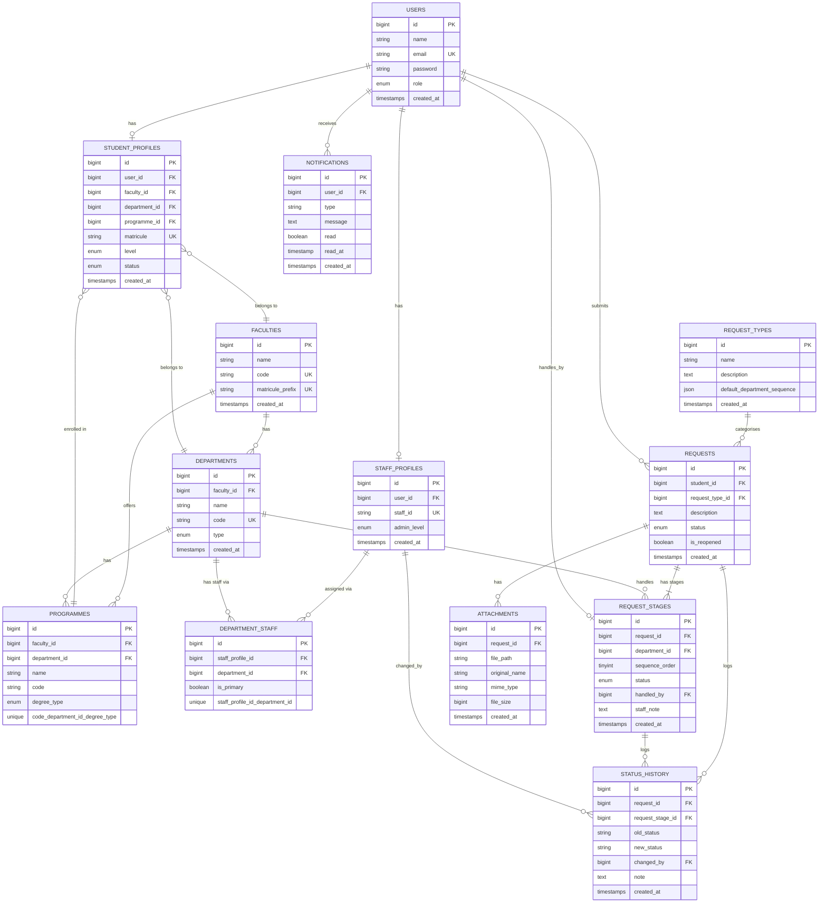
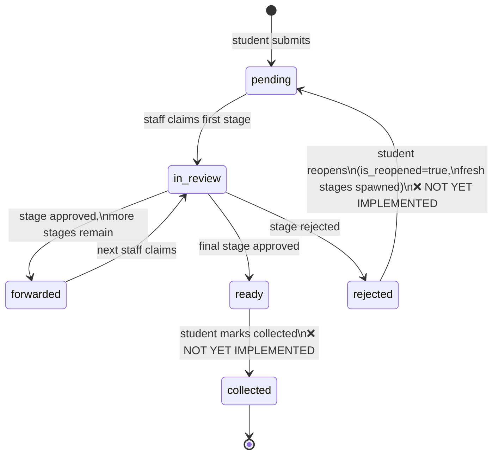
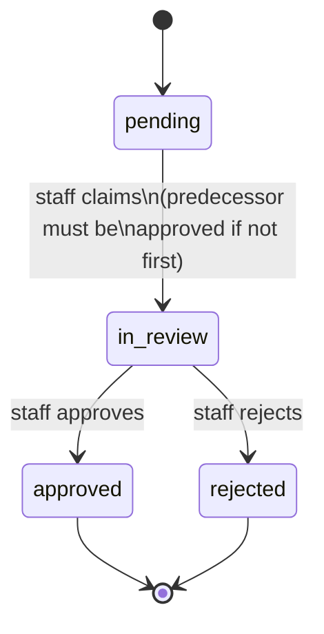

# CampusDesk — Database Documentation

## Technology

- **Database:** MySQL (via XAMPP)
- **ORM:** Laravel Eloquent
- **Charset:** `utf8mb4` / `utf8mb4_unicode_ci`
- **Migrations:** 27 migration files in `database/migrations/`

## Entity Relationship Diagram



## Table Definitions

### `faculties`
| Column | Type | Notes |
|--------|------|-------|
| id | bigint PK | auto-increment |
| name | string | e.g. "Faculty of Engineering & Technology" |
| code | string(20) UK | e.g. "FET" |
| matricule_prefix | string UK | e.g. "FE" — used for auto-generating student matricules |
| created_at / updated_at | timestamps | |

**Note:** `matricule_prefix` was added in migration `2026_07_21_090019_add_matricule_prefix_to_faculties_table`. The `Faculty.$fillable` includes `matricule_prefix`. The seeder populates this from `FacultyMatriculeMapper`.

### `departments`
| Column | Type | Notes |
|--------|------|-------|
| id | bigint PK | |
| faculty_id | bigint FK | → faculties.id, cascadeOnDelete |
| name | string | e.g. "Computer Engineering" |
| code | string(20) UK | e.g. "CE" |
| type | enum | `academic` \| `records` \| `admin` — added migration `2026_07_27_000001` |
| created_at / updated_at | timestamps | |

**Design note:** The `type` column classifies departments for routing logic. `FACULTY_RECORDS` symbolic token resolution uses `Department::where('type', 'records')`. The `Department.$fillable` includes `type`.

### `programmes`
| Column | Type | Notes |
|--------|------|-------|
| id | bigint PK | |
| faculty_id | bigint FK | → faculties.id (denormalised from department; auto-synced via model boot hook) |
| department_id | bigint FK | → departments.id, restrictOnDelete — added migration `2026_07_21_090636` |
| name | string | e.g. "BEng Computer Engineering" |
| code | string(20) | Unique per (code, department_id, degree_type) — see compound unique below |
| degree_type | enum | `BACHELOR` \| `CERTIFICATE` \| `MASTER` \| `PHD` |

**Unique constraint:** `(code, department_id, degree_type)` — compound key introduced in migration `2026_07_27_000004`. Earlier migrations used a single-column `code` unique, then `(code, department_id)` — both were too restrictive for UB's programme data.

**Note on degree_type values:** The enum was originally `BSc`, `BEng`, `MEng`, `MSc`, `PhD` and was changed to `BACHELOR`, `CERTIFICATE`, `MASTER`, `PHD` in migration `2026_07_27_000002`.

**Model boot hook:** `Programme::booted()` automatically synchronises `faculty_id` from `department->faculty_id` on `creating` and `updating` (when `department_id` changes). Do not set `faculty_id` manually when creating/updating programmes.

### `users`
| Column | Type | Notes |
|--------|------|-------|
| id | bigint PK | |
| name | string | |
| email | string UK | |
| password | string | hashed |
| role | enum | `student` \| `staff` |
| email_verified_at | timestamp nullable | |
| remember_token | string nullable | |
| created_at / updated_at | timestamps | |

**Note:** `role` enum was added via separate migration `add_role_to_users_table` after the default Breeze migration.

### `student_profiles`
| Column | Type | Notes |
|--------|------|-------|
| id | bigint PK | |
| user_id | bigint FK | → users.id, cascadeOnDelete |
| faculty_id | bigint FK | → faculties.id, cascadeOnDelete |
| department_id | bigint FK | → departments.id, cascadeOnDelete |
| programme_id | bigint FK | → programmes.id, cascadeOnDelete |
| matricule | string UK | e.g. "FE24A001" — format: {prefix}{year2}{section}{seq3} |
| level | enum | `100` \| `200` \| `300` \| `400` \| `500` \| `600` |
| status | enum | `active` \| `on_leave` \| `graduated` \| `suspended` (default: active) |
| created_at / updated_at | timestamps | |

**⚠️ Level enum values:** The level enum was changed from `L100`–`L600` to `100`–`600` (no `L` prefix) in migration `2026_07_21_111603_change_enum_values_on_student_profiles_table`. The backend validates `in:100,200,300,400,500,600`. The frontend `RegisterCredentials` TypeScript type still uses the old `L100` format — see KNOWN_ISSUES.md.

**Matricule format:** `{FACULTY_PREFIX}{ENROLLMENT_YEAR_2DIGIT}{SECTION_LETTER}{SEQ_3DIGIT}` — e.g. `FE24A001`. Generated by `UserFactory::createStudentProfile()`.

### `staff_profiles`
| Column | Type | Notes |
|--------|------|-------|
| id | bigint PK | |
| user_id | bigint FK | → users.id, cascadeOnDelete |
| staff_id | string UK | auto-generated in format `STAFF-{RANDOM6}` |
| admin_level | enum nullable | null = plain staff \| `dept_admin` \| `super_admin` |
| created_at / updated_at | timestamps | |

**Design decision:** `admin_level` is nullable on `staff_profiles` rather than a separate admin table. null = plain staff, `dept_admin` = scoped admin, `super_admin` = full access.

**Seeder behaviour:** `DepartmentStaffSeeder` auto-elevates each department's primary staff to `dept_admin`.

### `department_staff` (pivot)
| Column | Type | Notes |
|--------|------|-------|
| id | bigint PK | |
| staff_profile_id | bigint FK | → staff_profiles.id, cascadeOnDelete |
| department_id | bigint FK | → departments.id, cascadeOnDelete |
| is_primary | boolean | default false — drives default queue view |
| UNIQUE | (staff_profile_id, department_id) | prevents duplicate assignments |

**Note:** This table has NO `created_at`/`updated_at` columns. Do NOT call `withTimestamps()` on the relationship — it will cause `attach()` to fail.

**Seeder behaviour:** Every department is guaranteed exactly one primary staff member. Remaining staff pool members are assigned as secondary to random departments.

### `request_types`
| Column | Type | Notes |
|--------|------|-------|
| id | bigint PK | |
| name | string | e.g. "Transcript Request" |
| description | text nullable | |
| default_department_sequence | json | array of dept IDs and/or symbolic tokens |
| created_at / updated_at | timestamps | |

**Seeded request types:**
1. Transcript Request — sequence: `['STUDENT_DEPARTMENT', 'FACULTY_RECORDS', <TRD dept id>]`
2. Attestation of Enrollment — sequence: `['STUDENT_DEPARTMENT', 'FACULTY_RECORDS', <AOE dept id>]`
3. Attestation of Completion of Degree — sequence: `['STUDENT_DEPARTMENT', 'FACULTY_RECORDS', <AOC dept id>]`
4. Correction of Transcript — sequence: `['STUDENT_DEPARTMENT', 'FACULTY_RECORDS', <TRD dept id>]`

**Symbolic token resolution:** Tokens are resolved per-student at request-creation time. `"STUDENT_DEPARTMENT"` → student's department. `"FACULTY_RECORDS"` → the `records`-type department in the student's faculty. See DECISIONS.md ADR-07 and `app/Services/StageGenerationService.php`.

### `requests`
| Column | Type | Notes |
|--------|------|-------|
| id | bigint PK | |
| student_id | bigint FK | → users.id, cascadeOnDelete |
| request_type_id | bigint FK | → request_types.id, cascadeOnDelete |
| description | text nullable | |
| status | enum | `draft` \| `pending` \| `in_review` \| `forwarded` \| `ready` \| `collected` \| `rejected` (default: pending) |
| is_reopened | boolean | default false — set true when student reopens rejected request |
| created_at / updated_at | timestamps | |

### `request_stages`
| Column | Type | Notes |
|--------|------|-------|
| id | bigint PK | |
| request_id | bigint FK | → requests.id, cascadeOnDelete |
| department_id | bigint FK | → departments.id, cascadeOnDelete |
| sequence_order | tinyint unsigned | 1-based position in the workflow |
| status | enum | `pending` \| `in_review` \| `approved` \| `rejected` (default: pending) |
| handled_by | bigint FK nullable | → users.id, nullOnDelete (staff who claimed the stage) |
| staff_note | text nullable | |
| created_at / updated_at | timestamps | |

**Critical:** `handled_by` is null = unclaimed, set when staff claims the stage. The concurrency fix uses `lockForUpdate()` when claiming to prevent two staff members claiming the same stage.

### `status_history`
| Column | Type | Notes |
|--------|------|-------|
| id | bigint PK | |
| request_id | bigint FK | → requests.id, cascadeOnDelete |
| request_stage_id | bigint FK nullable | → request_stages.id, cascadeOnDelete |
| old_status | string nullable | null for initial submission |
| new_status | string | |
| changed_by | bigint FK nullable | → **staff_profiles.id** (NOT users.id), nullOnDelete |
| note | text nullable | |
| created_at / updated_at | timestamps | |

**⚠️ Critical design note:** `changed_by` references `staff_profiles.id` NOT `users.id`. See DECISIONS.md ADR-02. The FK was changed from `users.id` to `staff_profiles.id` in migration `2026_07_25_083626_change_foreign_key_constraint_on_status_history_table`.

When inserting, always resolve the staff_profile ID from user ID:
```php
$staffProfileId = StaffProfile::where('user_id', $userId)->value('id');
```

**Table name override:** `StatusHistory` model declares `protected $table = 'status_history'` (not `status_histories`).

**`$fillable` confirmed:** `['new_status', 'old_status', 'changed_by', 'request_id', 'request_stage_id', 'note']` — `request_stage_id` is included.

### `attachments`
| Column | Type | Notes |
|--------|------|-------|
| id | bigint PK | |
| request_id | bigint FK | → requests.id, cascadeOnDelete |
| file_path | string | storage path e.g. "attachments/abc123.pdf" |
| original_name | string | original filename |
| mime_type | string(100) | |
| file_size | bigint unsigned nullable | bytes |
| created_at / updated_at | timestamps | |

Files stored in `storage/app/attachments/` (private). Served through `AttachmentController`.

### `notifications`
| Column | Type | Notes |
|--------|------|-------|
| id | bigint PK | |
| user_id | bigint FK | → users.id, cascadeOnDelete |
| type | string | e.g. "stage_update" |
| message | text | |
| read | boolean | default false |
| read_at | timestamp nullable | |
| created_at / updated_at | timestamps | |

**Status:** Table and model exist. `Notification.$fillable` is NOT set (no entries). No backend endpoints exist to read or write notifications. `NotificationBell.vue` in the frontend uses mock data only.

## Table Name Overrides

Two models require explicit table name declarations due to non-standard names:

```php
// StatusHistory model
protected $table = 'status_history';  // NOT 'status_histories'

// DepartmentStaff model
protected $table = 'department_staff';  // NOT 'department_staffs'
```

## Request Status State Machine



## Stage Status State Machine



## Migration History (27 migrations)

| File | Purpose |
|------|---------|
| `0001_01_01_000000_create_users_table` | Default Laravel users, cache, jobs tables |
| `2026_04_10_005904_create_faculties_table` | faculties |
| `2026_04_10_010421_create_departments_table` | departments |
| `2026_04_10_011049_create_programmes_table` | programmes |
| `2026_04_10_011810_add_role_to_users_table` | adds role enum to users |
| `2026_04_10_012850_create_student_profiles_table` | student_profiles |
| `2026_04_10_071558_create_staff_profiles_table` | staff_profiles |
| `2026_04_10_072013_create_department_staff_table` | department_staff pivot |
| `2026_04_10_072730_create_request_types_table` | request_types |
| `2026_04_10_074853_create_requests_table` | requests |
| `2026_04_10_133618_create_request_stages_table` | request_stages |
| `2026_04_10_134327_create_status_history_table` | status_history |
| `2026_04_10_135144_create_attachments_table` | attachments |
| `2026_04_10_135313_create_notifications_table` | notifications |
| `2026_04_12_232151_create_personal_access_tokens_table` | Sanctum tokens |
| `2026_04_12_235141_add_role_to_student_profiles_table` | adds status enum to student_profiles |
| `2026_04_27_010207_add_column_to_departments_table` | adds name column to departments |
| `2026_07_21_090019_add_matricule_prefix_to_faculties_table` | adds matricule_prefix to faculties |
| `2026_07_21_090636_add_department_id_to_programmes_table` | adds department_id FK to programmes |
| `2026_07_21_111603_change_enum_values_on_student_profiles_table` | level: L100→100, etc. |
| `2026_07_25_083626_change_foreign_key_constraint_on_status_history_table` | changed_by: users→staff_profiles |
| `2026_07_27_000001_add_type_to_departments_table` | adds type enum to departments |
| `2026_07_27_000002_change_degree_type_enum_on_programmes_table` | BSc/BEng→BACHELOR/CERTIFICATE/etc. |
| `2026_07_27_000003_fix_programmes_code_unique_constraint` | code unique → (code, dept_id) unique |
| `2026_07_27_000004_fix_programmes_triple_unique_constraint` | (code, dept_id) → (code, dept_id, degree_type) |

## Seeder Data

The `DatabaseSeeder` calls in dependency order:

1. `FacultySeeder` — all UB faculties parsed from `university_programs_structure.md`
2. `DepartmentSeeder` — all departments with type; creates one `records` dept per faculty
3. `ProgrammeSeeder` — all programmes linked to departments
4. `StaffSeeder(80)` — 80 staff users with auto-generated profiles
5. `StudentSeeder(10/dept)` — 10 students per academic department
6. `DepartmentStaffSeeder` — assigns staff to departments; primary → `dept_admin`
7. `RequestTypeSeeder` — 4 request types with symbolic sequences

**No Tinker required:** Unlike early development, the full seeder suite including staff and department assignments is fully automated. `php artisan migrate:fresh --seed` produces a complete, usable dataset.

**Super admin accounts** are never seeded — create manually via Tinker:
```php
$user = App\Models\User::factory()->staff('super_admin')->create();
```
