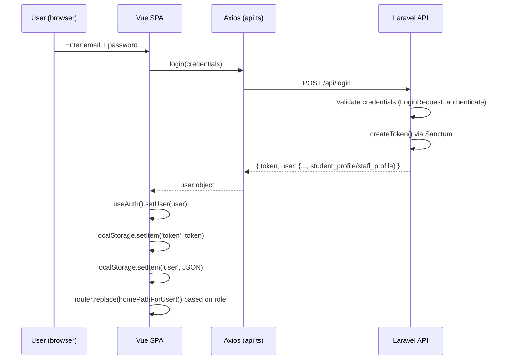
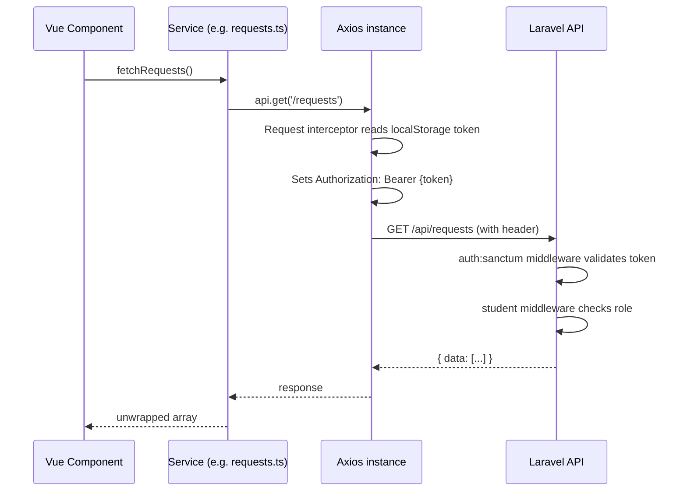
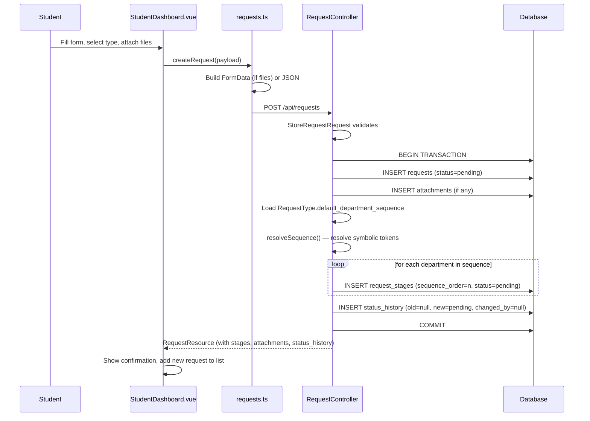
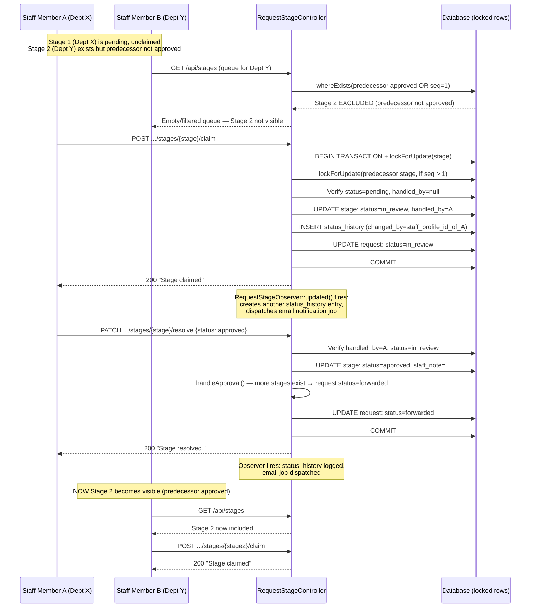
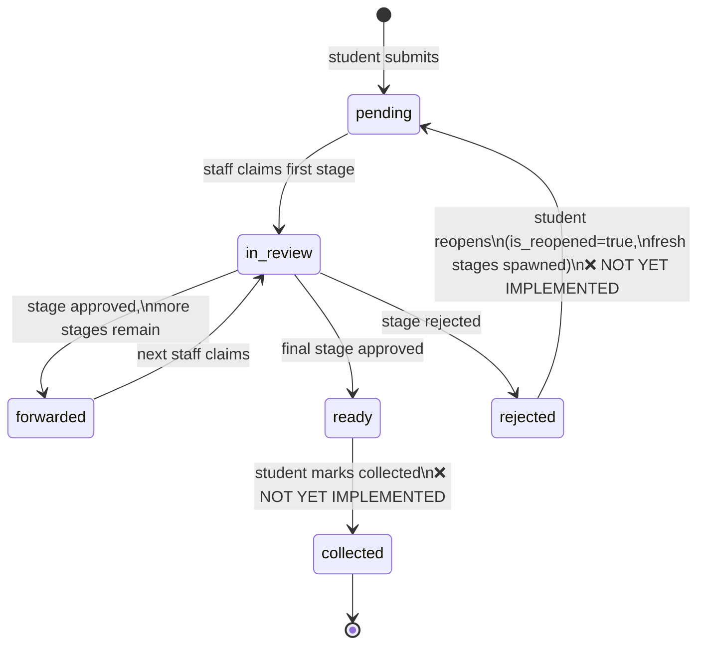
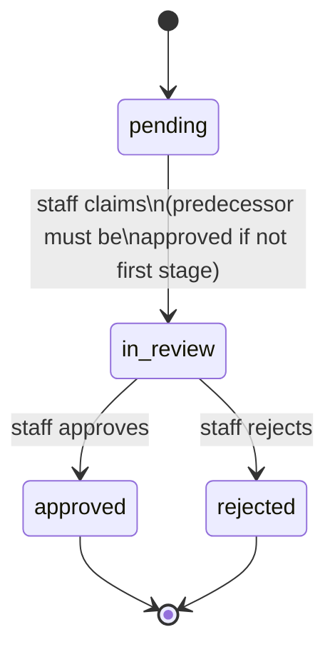
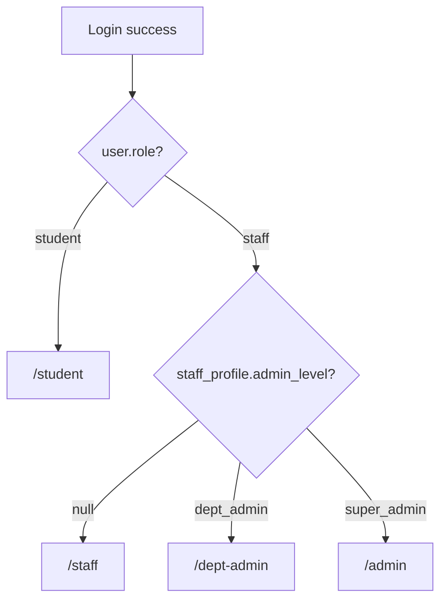
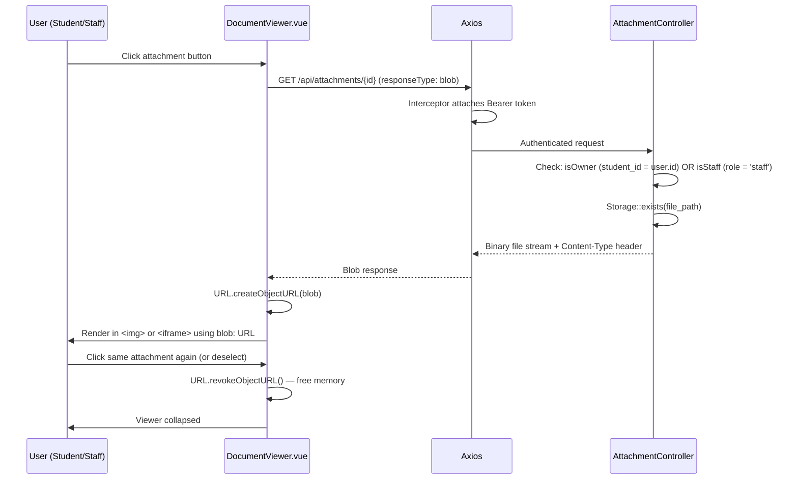
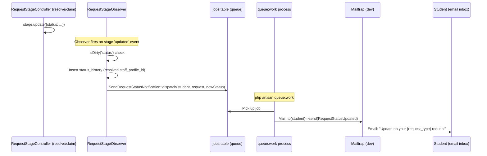

# CampusDesk — User Roles, Permissions & Flows

## User Roles

| Role | Storage | Description |
|------|---------|-------------|
| Student | `users.role = 'student'` + `student_profiles` row | Submits and tracks requests |
| Staff (plain) | `users.role = 'staff'` + `staff_profiles.admin_level = null` | Processes stages in their department(s) |
| Department Admin | `users.role = 'staff'` + `staff_profiles.admin_level = 'dept_admin'` | Oversees primary department, reassigns stages |
| Super Admin | `users.role = 'staff'` + `staff_profiles.admin_level = 'super_admin'` | Full system management |

**Seeder note:** `DepartmentStaffSeeder` automatically elevates each department's primary staff to `dept_admin`. Every department is guaranteed exactly one primary (dept_admin) staff member after seeding.

## Permission Matrix

| Action | Student | Staff | Dept Admin | Super Admin |
|---|---|---|---|---|
| Submit a request | ✅ | ❌ | ❌ | ✅ |
| View own requests | ✅ | ❌ | ❌ | ✅ |
| View all requests | ❌ | ❌ | ❌ | ✅ |
| View department queue | ❌ | ✅ | ✅ | ✅ |
| Claim a stage | ❌ | ✅ (own dept only) | ✅ | ✅ |
| Resolve a stage | ❌ | ✅ (own claim only) | ✅ | ✅ |
| Reassign a claimed stage | ❌ | ❌ | ✅ (own dept) | ✅ |
| Reopen rejected request | ✅ | ❌ | ❌ | ✅ |
| Upload attachments | ✅ | ❌ | ❌ | ✅ |
| View attachments | ✅ (own) | ✅ | ✅ | ✅ |
| Manage users | ❌ | ❌ | ❌ | ✅ |
| Manage departments/faculties | ❌ | ❌ | ❌ | ✅ |
| Manage request types | ❌ | ❌ | ❌ | ✅ |
| View audit log | ❌ | ❌ | 🟡 (own dept only — planned) | ✅ |
| Receive email notifications | ✅ | ❌ | ❌ | ❌ |

**Note:** This matrix reflects the INTENDED design. Admin-side permissions (reassign, manage, audit log) have no backend enforcement yet because the admin routes do not exist. The matrix is aspirational for those rows.

---

## Authentication Flow



Every subsequent request:


On 401 response:
```
Axios response interceptor → clears localStorage → window.location.href = '/login'
```

---

## Student Request Submission Flow



---

## Staff Claim & Resolve Flow (with concurrency fix)



---

## Request Lifecycle State Machine



## Stage-Level State Machine



---

## Role-Based Post-Login Routing (Frontend)



Implemented in `router/index.ts`'s `homePathForUser()` function, reading from `useAuth().user`.

Route guard logic:
- `/student` — requires `requiresAuth: true`, `roles: ['student']`
- `/staff` — requires `requiresAuth: true`, `staffLevel: 'plain'` (admin_level must be null)
- `/dept-admin` — requires `requiresAuth: true`, `staffLevel: 'dept_admin'`
- `/admin` — requires `requiresAuth: true`, `staffLevel: 'super_admin'`

---

## Document Viewing Flow (Secure Blob Pattern)



---

## Email Notification Flow



**Note:** The queue worker must be running. Use `composer run dev` to start it automatically alongside `php artisan serve`.
