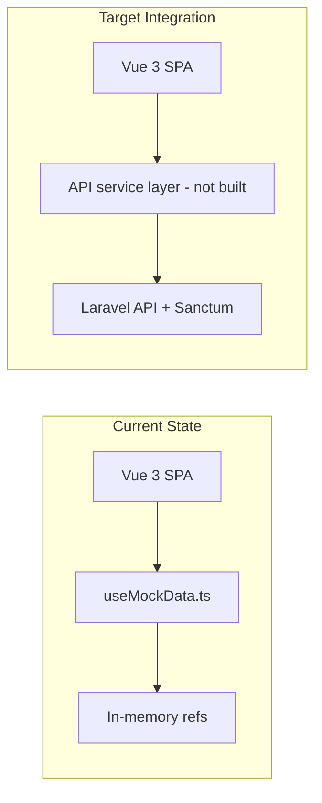

# CampusDesk Frontend — Backend Integration Specification

**Scope:** [`Frontend/`](Frontend/) directory only (primary app: [`Frontend/src/`](Frontend/src/))  
**Audience:** Laravel backend team  
**Date:** June 10, 2026

---

## Executive Summary

The CampusDesk frontend is a **Vue 3 + Vite SPA** that currently has **no backend integration**. All authentication, CRUD, and data loading run through an in-memory mock composable ([`Frontend/src/composables/useMockData.ts`](Frontend/src/composables/useMockData.ts)). There is no HTTP client installed, no `.env` configuration, no token persistence, and no request interceptors. The backend team should treat [`Frontend/src/types/index.ts`](Frontend/src/types/index.ts) and the mock composable's operations as the **intended API contract**, not as evidence of existing wiring.



---

## 1. Development Server

| Setting | Value | Source |
|---------|-------|--------|
| **Dev port** | `5173` (Vite default) | [`Frontend/package.json`](Frontend/package.json) — `"dev": "vite"` with no `--port` flag |
| **Preview port** | `4173` (Vite default) | `"preview": "vite preview"` |
| **Dev URL** | `http://localhost:5173` | Vite default when no `server.port` in config |
| **Entry point** | `/src/main.ts` | [`Frontend/index.html`](Frontend/index.html) |

[`Frontend/vite.config.js`](Frontend/vite.config.js) contains only Vue plugin + `@` path alias — **no `server.port`, no `server.proxy`**.

**Backend action:** Configure CORS/Sanctum for `http://localhost:5173`. The Laravel backend currently defaults to `http://localhost:3000` in [`campusdesk/config/cors.php`](campusdesk/config/cors.php) and `localhost:3000` in [`campusdesk/config/sanctum.php`](campusdesk/config/sanctum.php) — this does **not** match the Vue dev server.

---

## 2. HTTP Client

| Question | Answer |
|----------|--------|
| Axios? | **No** — not in dependencies |
| Fetch API? | **No** — zero `fetch()` calls in `Frontend/src/` |
| ofetch / ky / other? | **No** |
| API service layer? | **No** — no `services/` or `api/` directory |

**Dependencies in [`Frontend/package.json`](Frontend/package.json):** `vue`, `vue-router`, `date-fns`, `zod` (zod is installed but unused in `src/`).

**Conclusion:** An HTTP client must be chosen and added during integration (Axios or native Fetch are both viable; nothing is pre-decided).

---

## 3. Auth Token Storage

| Storage mechanism | Implemented? |
|-------------------|--------------|
| `localStorage` | **No** |
| `sessionStorage` | **No** |
| Pinia | **No** — not installed |
| Vuex | **No** |
| HTTP-only cookies | **No** |
| In-memory Vue `ref` | **Yes** — only mechanism |

Session state lives in a module-level ref:

```375:409:Frontend/src/composables/useMockData.ts
const sessionUser = ref<User | null>(null)
// ...
function login(email: string, password: string): User | null {
  const u = mockUsers.value.find(x => x.email === email && x.password === password)
  if (!u) return null
  sessionUser.value = u
  // ...
  return u
}

function logout() {
  sessionUser.value = null
  currentDepartmentId.value = null
}
```

**Implications for backend:**
- Sessions are **lost on page refresh**
- No `Authorization: Bearer` header is sent today
- No Sanctum CSRF cookie flow (`X-XSRF-TOKEN`, `withCredentials`) exists
- Auth strategy (Bearer token in localStorage vs Sanctum SPA cookie mode) is **undecided** and must be agreed between teams

---

## 4. API Base URL / Environment Variables

| Item | Status |
|------|--------|
| `.env` / `.env.example` in Frontend | **None found** |
| `VITE_*` variables | **None** |
| `import.meta.env` usage | **None in `src/`** |
| Vite proxy to backend | **None** |

There is no configured backend URL. When integration begins, the frontend will need something like `VITE_API_URL=http://localhost:8000/api` (exact Laravel port TBD by backend team).

---

## 5. State Management Architecture

- **Pattern:** Singleton composable ([`useMockData.ts`](Frontend/src/composables/useMockData.ts)) with module-level `ref`/`computed`
- **Not using:** Pinia, Vuex, or any global store library
- **Router:** [`Frontend/src/router/index.ts`](Frontend/src/router/index.ts) — `vue-router` v4 with `createWebHistory()` (HTML5 history mode, not hash mode)

Bootstrap in [`Frontend/src/main.ts`](Frontend/src/main.ts):

```1:8:Frontend/src/main.ts
import { createApp } from 'vue'
import App from './App.vue'
import { router } from './router'
import './style.css'

const app = createApp(App)
app.use(router)
app.mount('#app')
```

---

## 6. Authentication Flow (Current Mock Behavior)

### Login
- **UI:** [`Frontend/src/views/LoginView.vue`](Frontend/src/views/LoginView.vue)
- **Method:** Local string match against `mockUsers` array (email + plaintext password)
- **Payload sent to API today:** None
- **Expected form fields:** `email`, `password`
- **Post-login redirect:** Role-based routing (see section 7)
- **Redirect preservation:** `?redirect=` query param supported for protected routes

### Logout
- **UI:** [`Frontend/src/App.vue`](Frontend/src/App.vue) — `logout()` then `router.push('/login')`
- **No API call**

### Registration
- **UI:** [`Frontend/src/views/RegisterView.vue`](Frontend/src/views/RegisterView.vue)
- **Payload shape** ([`RegisterStudentPayload`](Frontend/src/composables/useMockData.ts)):

```typescript
{
  name: string
  email: string
  password: string
  matricule: string
  faculty_id: number
  department_id: number
  programme_id: number
  level: 'L100' | 'L200' | 'L300' | 'L400' | 'L500' | 'L600'
}
```

- **Gap:** Frontend does **not** collect `password_confirmation` (Laravel register typically requires it)
- **Reference data:** Faculty/department/programme dropdowns read from mock arrays, not API

### Route Guards
[`Frontend/src/router/index.ts`](Frontend/src/router/index.ts) uses `router.beforeEach`:
- `meta.guest` routes (`/login`, `/register`) redirect authenticated users away
- `meta.requiresAuth` routes redirect unauthenticated users to `/login?redirect=...`
- Role checks: `meta.roles: ['student']` for student routes
- Staff level checks: `meta.staffLevel: 'plain' | 'dept_admin' | 'super_admin'`

### Not Implemented
- Token refresh
- 401 interceptors / auto-logout
- "Remember me"
- Email verification UI
- Password reset UI

---

## 7. Role-Based Routing (Post-Login)

| User type | Condition | Route |
|-----------|-----------|-------|
| Student | `role === 'student'` | `/student` |
| Staff (plain) | `role === 'staff'`, `admin_level === null` | `/staff` |
| Dept Admin | `staff_profile.admin_level === 'dept_admin'` | `/dept-admin` |
| Super Admin | `staff_profile.admin_level === 'super_admin'` | `/admin` |

The `User` object **must** include nested profiles for dashboards to work:

```67:76:Frontend/src/types/index.ts
export interface User {
  id: number
  name: string
  email: string
  password: string
  role: UserRole
  created_at: string
  student_profile?: StudentProfile
  staff_profile?: StaffProfile
}
```

`staff_profile.admin_level` drives admin routing. `student_profile` provides matricule, level, faculty, department, programme for the student dashboard.

---

## 8. Expected Request/Response Formats

### Headers (not implemented; recommended for Bearer token approach)

```
Accept: application/json
Content-Type: application/json
Authorization: Bearer <token>
```

For file uploads (student requests): `Content-Type: multipart/form-data`

### Core Domain Types

Defined in [`Frontend/src/types/index.ts`](Frontend/src/types/index.ts):

**Request statuses:** `draft | pending | in_review | forwarded | ready | collected | rejected`

**Stage statuses:** `pending | in_review | approved | rejected`

**Request object** (frontend expects full nesting):

```117:128:Frontend/src/types/index.ts
export interface Request {
  id: number
  student_id: number
  request_type: RequestTypeEntity   // full object, not just a string
  description: string
  status: RequestStatus
  is_reopened: boolean
  created_at: string
  attachments: Attachment[]
  stages: RequestStage[]
  status_history: StatusHistoryEntry[]
}
```

**Staff stage resolution** (from StaffDashboard): `resolution: 'approved' | 'rejected'`, optional `staff_note` (required in UI when rejecting).

### File Upload Gap

[`StudentDashboard.vue`](Frontend/src/components/StudentDashboard.vue) currently stores only `{ name, type }` metadata — **not actual file bytes**. Integration requires sending real `File` objects as `attachments[]` via multipart form data.

---

## 9. Operations → Suggested API Endpoints

All operations today live in [`useMockData.ts`](Frontend/src/composables/useMockData.ts). Mapping for backend:

### Auth (Laravel routes exist in [`campusdesk/routes/auth.php`](campusdesk/routes/auth.php))

| Frontend mock function | Suggested endpoint | Notes |
|------------------------|-------------------|-------|
| `login()` | `POST /api/login` | Return `{ token, user }` with nested profiles |
| `logout()` | `POST /api/logout` | Requires auth middleware |
| `registerStudent()` | `POST /api/register` | Add `password_confirmation` on frontend |

### Student requests (partial Laravel routes in [`campusdesk/routes/api.php`](campusdesk/routes/api.php))

| Mock function | Suggested endpoint | Backend status |
|---------------|-------------------|----------------|
| `createStudentRequest()` | `POST /api/requests` | Route exists |
| `studentRequests` (computed) | `GET /api/requests` | Route exists |
| `reopenRequest()` | TBD | **No backend route** |
| `markCollected()` | TBD | **No backend route** |

### Staff workflow

| Mock function | Suggested endpoint | Backend status |
|---------------|-------------------|----------------|
| `unclaimedStages` / `myActiveStages` | `GET /api/requests/{id}/stages` | Route exists |
| `pickUpStage()` | `POST /api/requests/{id}/stages/{id}/claim` | Route exists |
| `updateStageResolution()` | `PATCH /api/requests/{id}/stages/{id}/resolve` | Route exists |
| `reassignStage()` | TBD | **No backend route** |

### Notifications

| Mock function | Suggested endpoint | Backend status |
|---------------|-------------------|----------------|
| `markNotificationRead()` | TBD | **No backend route** |
| `sessionNotifications` | TBD | **No backend route** |

### Admin / reference data (all mock-only today)

| Mock data / function | Used by | Backend status |
|---------------------|---------|----------------|
| `faculties`, `departments`, `programmes` | Register, Admin | **No routes** |
| `requestTypes` | Student, Admin | **No routes** |
| `saveFaculty`, `createFaculty`, etc. | AdminDashboard | **No routes** |
| `saveUserEntity`, `deleteUserEntity` | AdminDashboard | **No routes** |
| `adminOverrideRequestStatus` | AdminDashboard | **No routes** |
| `systemStats`, `departmentStats` | Admin dashboards | **No routes** |

---

## 10. Framework & Tooling Versions

From [`Frontend/package.json`](Frontend/package.json) / lockfile:

| Package | Version |
|---------|---------|
| Vue | ^3.4.0 (resolved ~3.5.x) |
| Vite | ^6.0.0 |
| vue-router | ^4.6.4 |
| TypeScript | 5.7.3 |
| Tailwind CSS | ^3.4.x |
| DaisyUI | ^5.5.x |
| date-fns | ^3.0.0 |

**Not installed:** Pinia, Vuex, Axios, ofetch

---

## 11. CORS / Cross-Origin (Frontend Side)

- No CORS configuration in the frontend
- No `credentials: 'include'` in source
- No Sanctum CSRF preflight handling
- No Vite dev proxy — API calls will go directly to the Laravel origin once implemented

**Backend must allow:** `http://localhost:5173` (and production frontend URL later).

---

## 12. Directory Notes (Avoid Confusion)

| Path | Status |
|------|--------|
| [`Frontend/src/`](Frontend/src/) | **Active Vue SPA** (19 source files) |
| [`Frontend/app/`](Frontend/app/) | Secondary/legacy scaffold — duplicate mocks, not the running app |
| [`Frontend/components/`](Frontend/components/) | React/shadcn UI artifacts — **not wired into Vue app** |
| [`Frontend/next.config.mjs`](Frontend/next.config.mjs) | Next.js config artifact — **unused by Vue SPA** |

Integration work should target **`Frontend/src/`** only.

---

## 13. Integration Gaps Checklist

1. **No HTTP client** — must be added with an API service layer
2. **No env-based API URL** — recommend `VITE_API_URL` + `.env.example`
3. **No token storage** — decide Bearer vs Sanctum cookie SPA mode
4. **CORS origin mismatch** — backend defaults to port `3000`, frontend uses `5173`
5. **Login response shape** — backend must return `user` with `student_profile` / `staff_profile` nested objects
6. **Register** — frontend missing `password_confirmation`
7. **Request create** — must send real files, not metadata-only attachments
8. **Response shape alignment** — frontend expects `request_type` as full object; verify Laravel API Resources match [`types/index.ts`](Frontend/src/types/index.ts)
9. **Many UI features have no backend routes** — notifications, reopen, collect, reassign, admin CRUD, reference data
10. **No 401 handling or token refresh** — sessions are ephemeral

---

## 14. Recommended Decisions for Both Teams

**Backend team should confirm:**
- API base URL (e.g. `http://localhost:8000/api`)
- Auth mode: Sanctum Bearer token vs SPA cookie (`withCredentials` + CSRF)
- CORS/Sanctum config updated to `http://localhost:5173`
- Login/register response JSON schema aligned with `User` type
- Which missing endpoints to prioritize (reference data for registration is blocking)

**Frontend team will need to:**
- Add HTTP client + `VITE_API_URL`
- Add token persistence and `Authorization` interceptor (or Sanctum cookie flow)
- Replace mock calls in `useMockData.ts` with API calls (incrementally)
- Add `password_confirmation` to registration form
- Send real file uploads for request attachments
